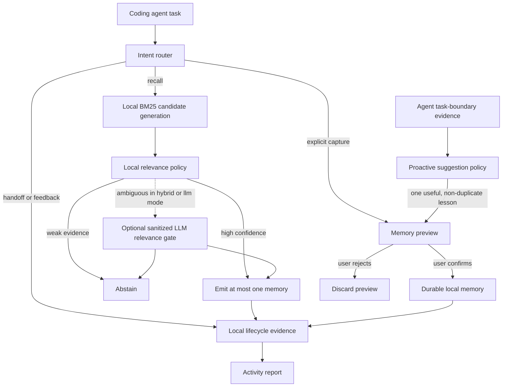

# Architecture

MemAgent is a local workflow-memory layer, not an autonomous coding agent.

The default router is heuristic and never makes a network request. `llm` and
`hybrid` modes are explicit opt-ins. They can send only a short sanitized task
summary, candidate draft, or up to three sanitized candidate-memory summaries,
plus minimal project-state booleans.

BM25 is deliberately candidate generation rather than the final answer. The
local relevance policy removes generic terms and unstable identifiers, checks
task specificity and memory-kind compatibility, and either emits one result or
abstains. Project preferences are useful only when the current task expresses
a compatible constraint; merely sharing a project or feature name is not
enough.

In `hybrid` mode, locally high-confidence and clearly irrelevant candidates do
not make network calls. Only ambiguous candidates can reach the optional LLM
gate. Provider failure falls back to abstention, preserving precision and local
availability.

Proactive capture is initiated by the coding agent only at a meaningful task
boundary. It passes one short lesson and an evidence category to `memagent
suggest`. MemAgent suppresses duplicate or already-pending suggestions, stores
only a pending preview, and waits for ordinary-language confirmation or
rejection.

`~/.memagent/` contains memory cards, pending previews, local traces, and
handoffs. Durable cards are written only after explicit confirmation.
