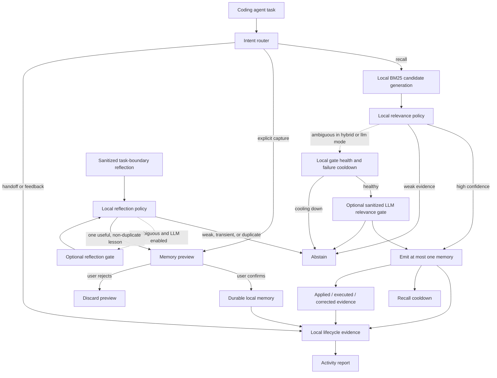

# Architecture

MemAgent is a local workflow-memory layer, not an autonomous coding agent.

The default router is heuristic and never makes a network request. `llm` and
`hybrid` modes are explicit opt-ins. They can send only a short sanitized task
summary, candidate draft, or up to three sanitized candidate-memory summaries,
plus minimal project-state booleans.

BM25 is deliberately candidate generation rather than the final answer. The
local relevance policy removes generic terms and unstable identifiers, checks
task specificity and memory-kind compatibility, and either emits one result or
abstains. Project preferences are useful only when the current task expresses
a compatible constraint; merely sharing a project or feature name is not
enough.

In `hybrid` mode, locally high-confidence and clearly irrelevant candidates do
not make network calls. Only ambiguous candidates can reach the optional LLM
gate. Provider failure falls back to abstention, preserving precision and local
availability. After two failures, or immediately after a rate limit, the local
gate-health state pauses further attempts for ten minutes. The request timeout
is three seconds.

Task memories and project constraints are evaluated separately. A concrete task
memory is preferred; a general preference requires explicit constraint intent.
In Codex, implicit recall of the same memory is suppressed after its first
injection in the current task. A new task has a different session identity and
can receive the memory immediately. When no session identity is available,
MemAgent falls back to a six-hour cooldown unless the next task adds new
discriminative terms. Explicit CLI recall bypasses both policies.

Automatic candidate discovery is initiated by the coding agent only at a
meaningful task boundary. It passes one short sanitized reflection and concrete
evidence categories to `memagent reflect`; it does not need to pre-write the
memory. The local policy rejects weak and transient lessons, checks existing
memories and pending previews before optional LLM use, and emits at most one
suggestion per Codex task. Reflection traces retain a summary hash and decision
metadata rather than the raw reflection. MemAgent stores only a pending preview
and waits for ordinary-language confirmation or rejection. Pending previews
expire after 48 hours. A new agent suggestion can replace a different agent
suggestion, but cannot replace a preview explicitly requested by the user.

Git worktrees are grouped by a hash of their local common Git directory. Remote
URLs are not stored. `~/.memagent/` contains memory cards, pending previews,
local traces, handoffs, and small runtime cooldown records. Durable cards are
written only after explicit confirmation.
