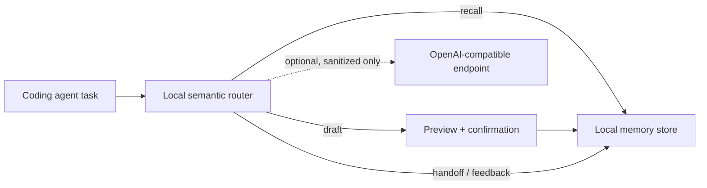

# Architecture

MemAgent is a local workflow-memory layer, not an autonomous coding agent.

The default router is heuristic and never makes a network request. `llm` and
`hybrid` modes are explicit opt-ins. They can send only a short sanitized task
summary or candidate draft, plus minimal project-state booleans.

`~/.memagent/` contains memory cards, pending previews, local traces, and
handoffs. Durable cards are written only after explicit confirmation.
