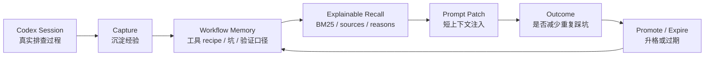

# MemAgent 对标调研与差异化

调研日期：2026-07-04

这份文档记录 MemAgent 周边已有项目和产品能力，用来帮助后续设计不要闭门造车，也方便面试时讲清楚“为什么还要做 MemAgent”。

更新：更细的 GitHub landscape refresh 见 [design_v0.24_landscape_refresh.md](design_v0.24_landscape_refresh.md)。该版本补充了 agentmemory、ai-memory、Reference、cccmemory、Headroom、Basic Memory、mind 等项目的分层判断，并把下一步建议收敛到 Codex transcript ingest + memory candidate review。

## 1. 结论

“coding agent memory” 已经不是空白方向。直接相似的项目已经出现，尤其是 [agentmemory](https://github.com/rohitg00/agentmemory) 和 [ai-memory](https://github.com/akitaonrails/ai-memory)。所以 MemAgent 不能只讲“跨会话记忆”或者“RAG 检索”，这些会显得像已有项目的轻量复刻。

MemAgent 更适合收敛成：

> Codex-first 的工程工作流记忆层：把真实 coding-agent 线程里的工具 recipe、失败路径、数据入口、验证方式，沉淀成可解释、可编辑、可召回、可评估的短上下文。

也就是说，MemAgent 的核心不是“保存所有上下文”，而是管理 **workflow memory lifecycle**：



## 2. 项目分层

| 类型 | 代表项目 | 核心能力 | 对 MemAgent 的启发 |
|---|---|---|---|
| 直接竞品：coding-agent memory backend | [agentmemory](https://github.com/rohitg00/agentmemory)、[ai-memory](https://github.com/akitaonrails/ai-memory)、[claude-mem](https://github.com/thedotmack/claude-mem)、[memsearch](https://github.com/zilliztech/memsearch) | hooks 捕获 session/tool use，跨 Codex/Claude Code/Cursor 复用记忆，MCP/REST/search/handoff，多层 progressive disclosure | 必须做出更清晰的 Codex-first workflow 定位，不能只做通用 memory backend |
| coding-agent memory 服务/平台 | [Hindsight](https://github.com/vectorize-io/hindsight)、[Redis Agent Memory Server](https://github.com/redis/agent-memory-server) | LLM wrapper、REST/MCP、working/long-term memory、hybrid search、多 provider | 可以借鉴抽取/检索/评估，但 MemAgent 不应变成重服务或强依赖外部 provider |
| Claude/Codex 记忆桥 | [mcp-memory-keeper](https://github.com/mkreyman/mcp-memory-keeper)、[memory-mcp](https://github.com/yuvalsuede/memory-mcp)、[claude-memory-compiler](https://github.com/coleam00/claude-memory-compiler)、[mind](https://github.com/Da7-Tech/mind) | Claude Code hooks、PreCompact/SessionEnd、CLAUDE.md/AGENTS.md brief、MCP search | 证明 handoff/catch-up 是强需求；MemAgent 要把这层做成 Codex-first 且可审阅 |
| 大而全上下文平台 | [ByteRover CLI](https://github.com/campfirein/byterover-cli) | context tree、云同步、review workflow、多 LLM provider、多 coding agent | 可借鉴 review/approve memory change，但 MemAgent 不应一开始平台化 |
| 本地 Markdown 知识层 | [Basic Memory](https://github.com/basicmachines-co/basic-memory) | local-first Markdown、SQLite index、MCP tools、tool annotations、schema validate | 可借鉴 Markdown source of truth、doctor/schema check、MCP 行为标注 |
| 上下文压缩层 | [Headroom](https://github.com/headroomlabs-ai/headroom) | 压缩 tool outputs/logs/RAG chunks/files/conversation，CCR 可逆取回，wrap Codex/MCP | 可用于后续“memory prompt patch 压缩”，解决召回越多越吵 |
| 通用 agent memory SDK | [Mem0](https://github.com/mem0ai/mem0)、[LangMem](https://github.com/langchain-ai/langmem) | LLM extraction、memory tools、background consolidation、semantic/BM25/entity retrieval | 可借鉴 extraction/consolidation/evaluation，但它们不专注 coding workflow |
| coding agent IDE/MCP 工具 | [Serena](https://github.com/oraios/serena)、[codebase-memory-mcp](https://github.com/DeusData/codebase-memory-mcp)、[NeuralMind](https://github.com/dfrostar/neuralmind) | 代码语义检索、symbol-level navigation、code knowledge graph、上下文压缩 | 适合未来增强“代码库上下文”，但不是 workflow memory 的替代 |
| 宿主内建记忆/文件式记忆 | [GitHub Copilot Memory](https://docs.github.com/copilot/concepts/agents/copilot-memory)、[Cline Memory Bank](https://cline.bot/blog/memory-bank-how-to-make-cline-an-ai-agent-that-never-forgets) | 内建 repo/user memory，或通过 memory-bank 文件恢复项目上下文 | 说明用户确实需要跨会话记忆；MemAgent 的优势是本地可控、跨 agent、可解释 |

## 3. 直接竞品分析

### 3.1 agentmemory

agentmemory 和 MemAgent 撞题程度最高。它强调：

- coding agent session 结束后不会忘记。
- 通过 hooks 捕获 tool use、prompt、session lifecycle。
- 用 LLM compress 成 structured facts、concepts、narrative。
- 检索上走 BM25 + vector + graph，并支持 RRF fusion。
- SessionStart 时按 token budget 注入上下文。
- 有 Memory evolution、TTL、contradiction detection、Git snapshots、observability。

MemAgent 要避开的重复点：

- 不要只做“另一个 MCP memory server”。
- 不要只堆 BM25/vector/graph 名词。
- 不要在还没真实跑通 Codex 场景时追求全自动 hooks。

MemAgent 可以借鉴：

- capture pipeline：raw observation -> structured memory -> index。
- session-start 注入：不是用户手动复制 recall 结果。
- 记忆来源和引用：每条 memory 可追溯到哪次线程或哪段总结。
- 评估和可观测：recall 不只返回文本，还返回 score、matched terms、hit rate。

### 3.2 ai-memory

ai-memory 的产品语言很值得借鉴：不同 agent vendor 之间 handoff，不用重新解释架构、失败路径和 open questions。它也强调 lifecycle hooks 捕获 prompt、tool calls、compaction checkpoint 和 session boundary，新会话前拉取 handoff。

MemAgent 可以借鉴：

- `where did we leave off?`
- `catch me up`
- pending handoff
- read-only web view / memory browser
- per-cwd project routing

但 MemAgent 不需要一开始做常驻 server 或多用户部署。当前更适合先把本地 Codex AGENTS.md 集成、MCP stdio、demo-run、recall-eval 做扎实。

### 3.3 claude-mem / memsearch

claude-mem 和 memsearch 都强调跨 agent 的持久上下文，并且都在解决 token 成本问题。claude-mem 的三层查询思路很值得学：先拿 compact search 结果，再看 timeline，最后只取少量 full observations。memsearch 也把 Claude Code、Codex CLI、OpenClaw 等 agent 作为直接集成对象，并强调 Markdown source 和 hybrid retrieval。

MemAgent 可以借鉴：

- progressive disclosure：先给短索引和 top match，不一上来塞完整历史。
- local source of truth：memory 文件可读可审计，index 可以重建。
- multi-agent compatibility：MCP/AGENTS.md 只是入口，底层 memory 不绑定某个宿主。

MemAgent 仍要避免：

- 变成另一个通用 memory daemon。
- 把“存得更多”当成主要价值。
- 忽略真实工程 recipe、失败路径和验证方式这些 workflow 语义。

### 3.4 Hindsight / Redis Agent Memory Server

这类项目更像 memory service 或 application memory substrate：有 HTTP API、MCP、provider 配置、working memory / long-term memory、semantic/keyword/hybrid search、自动抽取和总结。

MemAgent 可以借鉴：

- provider 抽象：OpenAI、Anthropic、Ollama、OpenAI-compatible endpoint 等。
- working memory 与 durable memory 分层。
- hybrid retrieval 和 metadata filter。
- 后台 consolidation 与 evaluation。

但短期不要复制它们的服务端架构。MemAgent 目前最有价值的是把个人 Codex 工程流打透，而不是做一个需要 Docker/数据库/后台服务的通用平台。

### 3.5 mcp-memory-keeper / memory-mcp / claude-memory-compiler / mind

这些项目集中在 Claude Code / Codex 的上下文丢失和压缩边界：session end、PreCompact、CLAUDE.md/AGENTS.md brief、MCP search、LLM extraction。它们说明一个点：长线程变卡、换会话丢上下文，是 coding agent 用户的共同痛点。

MemAgent 已经有 `handoff save/show/draft/promote`，后续可以继续往这些方向靠：

- 从长线程生成 handoff draft。
- 把 handoff 中的 durable lesson 显式升格成 memory card。
- 新会话开始先 catch-up，再召回长期 workflow memory。
- 保持 draft-first，不自动污染长期记忆。

## 4. 相邻能力分析

### 4.1 Headroom

Headroom 不是纯 memory backend，而是 context compression layer。它最值得 MemAgent 学的是：不要把召回结果原样塞进 prompt，而是做 token-aware context packing。MemAgent v0.15 已经落地第一版本地 context packer：先做去重、行数/字符预算和 truncation 标记，后续再扩成 tokenizer-aware 或 LLM compression。

后续 MemAgent 可以做：

```text
recall results
  -> priority ranking
  -> dedupe
  -> short prompt patch
  -> optional compression / retrieve-on-demand
```

这比“召回 top-k memory cards”更像真实可用的 coding-agent 上下文工程。

### 4.2 Basic Memory

Basic Memory 证明了一个方向：长期知识不一定要先进数据库，Markdown 文件可以作为人和 agent 共同维护的 source of truth，再用 SQLite/MCP 做索引和访问层。

MemAgent 当前 YAML memory card 路线与它兼容：

- 本地文件可读可改。
- index 可以重建。
- `agents-doctor` 类似健康检查。
- 后续 MCP tools 可以标注 read-only / destructive / idempotent 行为，降低 agent 误用成本。

### 4.3 Mem0 / LangMem

Mem0 和 LangMem 更像通用 long-term memory framework。它们的价值在底层技术：

- LLM-assisted extraction。
- background consolidation。
- semantic / BM25 / entity retrieval。
- memory update / contradiction / temporal reasoning。
- benchmark-driven evaluation。

MemAgent 可以学这些机制，但场景必须保持 coding workflow：工具 recipe、失败路径、数据入口、验证命令，而不是普通聊天偏好。

## 5. MemAgent 的差异化句式

面试中可以这样讲：

> 市面上已经有通用 memory backend，例如 agentmemory、ai-memory、claude-mem、memsearch；也有通用 memory SDK，例如 Mem0、LangMem。MemAgent 的切入点更窄：我不是要替代 coding agent，而是做 Codex-first 的工程工作流记忆层。它把真实线程中的工具 recipe、失败路径和验证方式沉淀为本地可编辑 memory card，通过 AGENTS.md/MCP 让 Codex 自然召回，并用 explainable recall、recall-eval 和 trace-eval 验证检索质量。

再展开为四个差异点：

- **Workflow-first**：记的是“下次怎么做”，不是泛泛知识片段。
- **Codex-first integration**：AGENTS.md 自然语言触发、prompt patch、doctor/install/demo-run 都围绕 Codex。
- **Local-private exactness**：本地私有 memory 可以保留必要工程入口，公开 demo 再泛化。
- **Explainable and evaluable**：召回显示来源、分数、命中词；`recall-eval` 跑 mock Hit@1/MRR，`trace eval` 从真实 labeled traces 生成报告。

## 6. 不做什么

MemAgent 暂时不追求替代这些系统：

- 不做通用 agent 平台。
- 不做 IDE 内建全局记忆。
- 不做重型知识库。
- 不做强绑定某个模型供应商的记忆产品。
- 不做代码语义索引工具的替代品。

它要先解决一个更窄但真实的问题：

```text
同一个开发者在 Codex 里反复解决工程问题，
但成功命令、失败路径、正确入口和验证口径无法跨线程复用。
```

## 7. 路线建议

短期继续做 Codex-first：

```text
AGENTS.md natural-language trigger
  + local workflow memory cards
  + explainable recall
  + Codex prompt patch
  + recall-eval / trace-eval
```

中期补齐 memory lifecycle：

```text
thread/session ingest
  + memory draft review
  + stale/duplicate/conflict detection
  + handoff / catch-me-up
  + context packing
```

长期再扩成 coding-agent memory substrate：

```text
MCP tools
  + optional hooks
  + optional vector/entity retrieval
  + optional browser/dashboard
  + multi-agent support
```

这个定位能避免两个极端：

- 只做 `AGENTS.md` 片段，项目太薄。
- 一上来做通用 agent 平台，边界太散。
