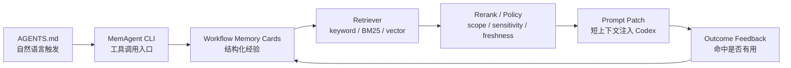

# MemAgent 对标调研与差异化

调研日期：2026-07-04

这份文档记录 MemAgent 周边已有项目和产品能力，用来帮助后续设计不要闭门造车，也方便面试时讲清楚“为什么还要做 MemAgent”。

## 1. 结论

“coding agent memory” 已经不是空白方向。已有项目大致分成四类：

| 类型 | 代表 | 核心能力 | 对 MemAgent 的启发 |
|---|---|---|---|
| 记忆服务 / MCP | [AgentMemory](https://github.com/rohitg00/agentmemory)、[ai-memory](https://github.com/akitaonrails/ai-memory) | 给多个 agent 提供持久记忆、搜索、MCP/REST 接入 | MemAgent 后续可以做 MCP，但第一阶段要先把 Codex 工作流跑顺 |
| 会话总结编译 | [claude-memory-compiler](https://github.com/coleam00/claude-memory-compiler) | 从 Claude Code hooks/session 中提取决策和经验，编译成知识文档 | 后续 `ingest` 可以学习这种“从长线程抽取经验”的链路 |
| 规则/工作流文件 | [cursor-memory-bank](https://github.com/vanzan01/cursor-memory-bank) | 用 `memory-bank/` 和命令化流程组织 Cursor 项目上下文 | MemAgent 不应变成重型流程框架，但可以学习分层上下文和归档机制 |
| 宿主内建记忆 | [VS Code agent memory](https://code.visualstudio.com/docs/agents/memory)、[GitHub Copilot memory](https://github.blog/ai-and-ml/github-copilot/building-an-agentic-memory-system-for-github-copilot/) | IDE/平台内置跨会话记忆 | MemAgent 的价值在于本地可控、跨 coding agent、可检查和可编辑 |

MemAgent 的差异化不应该是“我也有长期记忆”，而是：

> Codex-first 的工程工作流记忆层：把真实 coding-agent 线程里的工具 recipe、失败路径、数据入口、验证方式，沉淀成可解释、可编辑、可召回的短上下文。

## 2. MemAgent 不做什么

MemAgent 暂时不追求替代这些系统：

- 不做通用 agent 平台。
- 不做 IDE 内建全局记忆。
- 不做重型知识库。
- 不做强绑定某个模型供应商的记忆产品。

它要先解决一个更窄但真实的问题：

```text
同一个开发者在 Codex 里反复解决工程问题，
但成功命令、失败路径、正确入口和验证口径无法跨线程复用。
```

## 3. 可面试的技术主线

MemAgent 可以把常见 AI 知识点串在一个实际项目里，而不是堆概念。



对应面试讲法：

- **Agent 工具调用**：Codex 根据 `AGENTS.md` 的自然语言规则调用 MemAgent CLI。
- **RAG**：memory card 是检索语料，recall 是 retriever，prompt patch 是检索增强上下文。
- **MCP**：未来可以把 CLI 封装成 MCP server，让 Codex/Cursor/Claude Code 通过统一工具协议调用。
- **Memory lifecycle**：记录、召回、验证、过期、升格到 `AGENTS.md`，这是 MemAgent 相比普通 RAG 更有产品性的部分。
- **安全边界**：本地私有记忆可保留必要工程入口，公开导出和 demo 必须泛化。

## 4. 与类似项目的差异点

### 4.1 对比 AgentMemory / ai-memory

这类项目更像通用 memory backend，强调多 agent、MCP、向量/图/全文搜索等能力。

MemAgent 当前选择更窄：

- 先主攻 Codex 场景。
- memory card 面向 workflow，而不是普通知识片段。
- 召回结果要能直接拼到 Codex prompt 前。
- 保留 `AGENTS.md` 触发层，让用户不用记命令。

后续可借鉴：

- MCP server。
- SQLite FTS / BM25 / vector index。
- 命中统计和记忆浏览器。

### 4.2 对比 claude-memory-compiler

claude-memory-compiler 的方向是从 Claude Code 会话里自动提取知识。

MemAgent 后续可以做类似 `ingest`：

```text
长 Codex 线程 / markdown 复盘
  -> LLM extraction
  -> memory draft
  -> 用户确认
  -> 写入 local memory
```

但当前阶段先做手动 `remember` 和 AGENTS 自然语言触发，因为这更可控，也更容易验证真实价值。

### 4.3 对比 Cursor Memory Bank

Cursor Memory Bank 更像项目工作流系统，强调 plan/build/reflect/archive。

MemAgent 不想让用户迁移到一套新流程，而是做 Codex 旁边的小工具：

```text
用户仍然在 Codex 里开发
MemAgent 只在“召回一下”和“沉淀一下”时介入
```

这也是项目边界：辅助 coding agent，而不是重写 coding agent 的整个工作方式。

### 4.4 对比 VS Code / Copilot 内建记忆

内建记忆胜在体验统一，但用户不一定能完全控制：

- 记了什么。
- 为什么召回。
- 哪些内容可以公开。
- 是否能跨不同 coding agent 使用。

MemAgent 的优势是本地可解释：

- memory card 是文件。
- recall 可以显示来源和命中原因。
- 用户能编辑、删除、迁移。
- 私有记忆和公开 demo 可以分开。

## 5. 当前产品定位

短期：

```text
AGENTS.md natural-language trigger
  + local workflow memory cards
  + explainable recall
  + Codex prompt patch
```

中期：

```text
LLM ingest
  + BM25/vector hybrid recall
  + memory lifecycle signals
  + MCP adapter
```

长期：

```text
coding-agent memory substrate
  服务 Codex、Cursor、Claude Code 等多个 agent
```

这个定位能避免两个极端：

- 只做 `AGENTS.md` 片段，项目太薄。
- 一上来做通用 agent 平台，边界太散。

