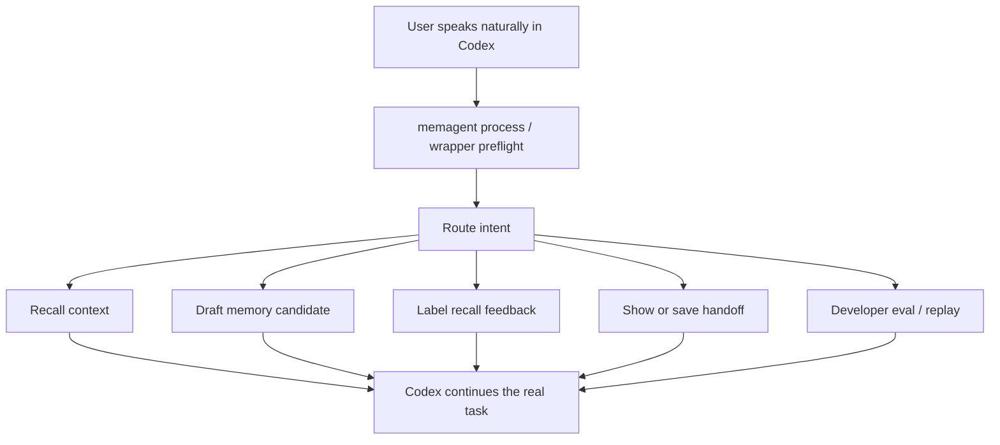

# v0.26-v0.31 Completion Audit: Codex-Native Memory UX

## Goal

Make MemAgent feel like a background memory helper for Codex instead of a separate
RAG tool. Users should be able to speak naturally, while MemAgent decides whether
the interaction is about recall, memory drafting, feedback, handoff, or developer
evaluation.

## Evidence Matrix

| Requirement | Implemented Surface | Evidence |
| --- | --- | --- |
| Task start can recall relevant experience | `memagent process`, `memagent_process`, `memagent codex` process-first preflight | `tests/test_interaction.py`, `tests/test_cli.py`, `tests/test_wrapper.py` |
| Conversation can produce memory candidates | `draft_memory` route and process action; writes stay behind confirmation | `tests/test_router.py`, `tests/test_draft.py`, `tests/test_interaction.py` |
| Recall usefulness can be captured | Natural feedback phrases route to latest trace labeling | `tests/test_interaction.py`, `tests/test_eval.py` |
| Long sessions can create/resume handoff | `handoff_save` and `handoff_show` route, process, CLI, and MCP surfaces | `tests/test_interaction.py`, `tests/test_handoff.py`, `tests/test_mcp.py` |
| LLM-assisted interaction is provider-pluggable | OpenAI-compatible provider, local profiles, `llm doctor` live checks | `tests/test_llm.py`, `tests/test_router.py`, `tests/test_draft.py`, `docs/design_v0.30_llm_provider_readiness.md` |
| Wrapper no longer hard-codes recall-first | `memagent codex` calls `process_interaction` before rendering prompt context | `tests/test_cli.py`, `tests/test_wrapper.py`, `docs/design_v0.31_process_first_wrapper.md` |
| Trace/eval/replay are developer tools, not user UX | Eval and replay remain explicit commands/MCP tools for quality measurement | `tests/test_eval.py`, `docs/design_v0.20_trace_eval.md`, `docs/design_v0.23_trace_replay.md` |
| Codex can discover the behavior through project policy | AGENTS snippet explains natural language triggers and safety boundaries | `docs/agents-integration.md`, `src/memagent/agents.py`, `tests/test_agents_snippet.py` |

## Interaction Shape

## Current Boundary

This completes the v0.26-v0.31 product slice: Codex-native memory UX with local
heuristics and optional LLM assistance. The next meaningful product step should
focus on quality rather than more surfaces: better candidate ranking, richer
LLM-assisted drafting, and safer confirmation flows for private coding memories.
