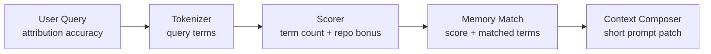

# Codex AGENTS.md 集成演示

这份 demo 用来证明 v0.3-v0.5 的核心闭环：

```text
agents-install 安装 + agents-doctor 自检
  -> Codex 自然语言识别 recall / remember
  -> MemAgent 本地写入和召回 memory
  -> 从 session notes 生成 handoff draft
  -> 保存 handoff 并在新会话 catch up
  -> 短上下文拼给 Codex
```

示例全部使用 mock 工程信息，适合公开演示。

## 1. 准备隔离的 demo memory home

在 MemAgent 项目根目录运行：

```bash
PYTHONPATH=src python -m memagent.cli demo-run --reset
```

它会创建：

```text
local_memory_demo/demo_run/
  project/
    AGENTS.md
    pyproject.toml
  memagent_home/
    memories/
    handoffs/
  session_notes.md
  transcript.md
```

`transcript.md` 是完整演示记录，包含 install、doctor、remember、recall、codex dry-run、handoff draft/save/show 的命令和输出。

如果想手动分步演示，可以继续按下面步骤运行。

```bash
mkdir -p local_memory_demo/agents_flow
```

后续命令都使用：

```bash
MEMAGENT_HOME=local_memory_demo/agents_flow PYTHONPATH=src python -m memagent.cli ...
```

这样不会污染你真实的 `~/.memagent`。

## 2. 生成 AGENTS.md snippet

```bash
PYTHONPATH=src python -m memagent.cli agents-snippet
```

演示重点：

- 输出里有 recall 触发语，比如 `召回一下相关记忆`。
- 输出里有 remember 触发语，比如 `沉淀一下`。
- 输出里有 handoff 触发语，比如 `上次做到哪` 和 `交接一下`。
- recall 命令带 `--show-sources --show-reasons --strategy bm25`，能展示来源、命中原因和召回策略。
- 安全规则说明 local private memory 和 public demo 的边界。

也可以用安装器预览写入当前项目 `AGENTS.md` 的效果：

```bash
MEMAGENT_HOME=local_memory_demo/agents_flow PYTHONPATH=src python -m memagent.cli agents-install
```

安装器默认只是 dry-run；真的写入时必须显式加 `--write`：

```bash
MEMAGENT_HOME=local_memory_demo/agents_flow PYTHONPATH=src python -m memagent.cli agents-install --write
```

公开 demo 时，建议用临时目录演示 `--write`，不要直接改真实业务仓库的 `AGENTS.md`。

## 3. 模拟新线程：第一次 recall 没有记忆

先跑一次 doctor，确认当前项目是否已经接入了 MemAgent AGENTS.md 触发规则：

```bash
MEMAGENT_HOME=local_memory_demo/agents_flow PYTHONPATH=src python -m memagent.cli agents-doctor
```

如果当前项目的 `AGENTS.md` 还没有 MemAgent snippet，会看到 `Status: setup needed`。这不是失败，而是在提醒先把 `agents-snippet` 的输出复制到目标项目的 `AGENTS.md`。

```bash
MEMAGENT_HOME=local_memory_demo/agents_flow PYTHONPATH=src python -m memagent.cli recall \
  "召回一下相关记忆，我要排查 demo 服务的 attribution accuracy" \
  --show-sources --show-reasons --strategy bm25
```

预期会看到：

```text
[MemAgent recalled context]
- No related memories found.
```

这一步对应真实 Codex 场景：

```text
用户：召回一下相关记忆，我要排查 demo 服务的 attribution accuracy
Codex：按 AGENTS.md 调用 memagent recall
```

## 4. AGENTS.md 接入自检的展示方式

在已经复制 snippet 的项目里运行：

```bash
MEMAGENT_HOME=local_memory_demo/agents_flow PYTHONPATH=src python -m memagent.cli agents-doctor
```

预期看到：

```text
[MemAgent AGENTS.md doctor]
- AGENTS.md files:
  - .../AGENTS.md: ready
    - MemAgent section: yes
    - recall command: yes
    - remember command: yes
    - handoff command: yes
    - explainable recall: yes
- Status: ready
```

面试时可以先展示 doctor，再展示 recall/remember。这样观众会先知道“Codex 为什么能自然语言触发 MemAgent”。

## 5. 模拟沉淀一条 workflow memory

```bash
MEMAGENT_HOME=local_memory_demo/agents_flow PYTHONPATH=src python -m memagent.cli remember \
  --domain coding \
  --kind data_entrypoint \
  --repo demo_service \
  --module attribution \
  --topic "Demo attribution accuracy entrypoint" \
  --trigger attribution \
  --trigger accuracy \
  --trigger audit_label \
  "For demo attribution accuracy checks, start from the audit_label snapshot table, sample by primary-key ranges, then compare model output with human-reviewed labels. Avoid full-table JSON aggregation before sampling."
```

这一步对应真实 Codex 场景：

```text
用户：沉淀一下，下次查 attribution accuracy 先从 audit_label 快照入口开始
Codex：总结短 memory，调用 memagent remember
```

## 6. 再次 recall：看到来源和命中原因

```bash
MEMAGENT_HOME=local_memory_demo/agents_flow PYTHONPATH=src python -m memagent.cli recall \
  "先看看之前有没有 attribution accuracy 的相关经验" \
  --show-sources --show-reasons --strategy bm25
```

预期输出包含：

```text
- Memory: Demo attribution accuracy entrypoint [coding/data_entrypoint] (...memory.yaml) | score=...
```

`matched=...` 会展示 query 命中的词，例如 `attribution`、`accuracy`。

这就是 v0.3 新增的可解释召回能力：



## 7. 演示 Codex prompt patch

不真正启动 Codex，只看拼出来的 prompt：

```bash
MEMAGENT_HOME=local_memory_demo/agents_flow PYTHONPATH=src python -m memagent.cli codex \
  --dry-run \
  --show-sources \
  --show-reasons \
  "我要继续排查 demo 服务 attribution accuracy，先给我一个排查计划"
```

预期结构：

```text
[MemAgent recalled context]
- Task: ...
- Context: ...
- Memory: Demo attribution accuracy entrypoint [coding/data_entrypoint] (...) | score=...
  - ...

[User task]
我要继续排查 demo 服务 attribution accuracy，先给我一个排查计划
```

这一步是面试演示的关键画面：MemAgent 没有替代 Codex，而是给 Codex 注入一段短、可解释、来源明确的 workflow memory。

## 8. 演示 handoff / catch-up

准备一份 session notes：

```bash
cat > local_memory_demo/agents_flow/session_notes.md <<'EOF'
## Summary
Demo session wired AGENTS.md, saved one attribution accuracy memory, and verified recall plus Codex prompt patch.

## Done
- Installed AGENTS.md block.
- Verified recall with sources and reasons.

## Next Steps
- Use the handoff as the next-session catch-up context.

## Open Questions
- Should handoff drafts be generated automatically from session logs?
EOF
```

先生成可审阅草稿：

```bash
MEMAGENT_HOME=local_memory_demo/agents_flow PYTHONPATH=src python -m memagent.cli handoff draft \
  --from-file local_memory_demo/agents_flow/session_notes.md \
  --topic "Demo continuation handoff"
```

确认草稿没问题后保存：

```bash
MEMAGENT_HOME=local_memory_demo/agents_flow PYTHONPATH=src python -m memagent.cli handoff draft \
  --from-file local_memory_demo/agents_flow/session_notes.md \
  --topic "Demo continuation handoff" \
  --save
```

新会话开始时 catch up：

```bash
MEMAGENT_HOME=local_memory_demo/agents_flow PYTHONPATH=src python -m memagent.cli handoff show
```

这一步用来讲清楚 handoff 和 memory card 的区别：

- handoff 是最近项目状态，解决“上次做到哪”。
- memory card 是长期经验，解决“类似问题下次怎么做”。
- `handoff draft` 是写入前的可审阅草稿，避免 agent 自动污染长期或近期状态。

## 9. Demo 讲解词

可以这样讲：

> 我做的不是一个通用 agent，而是 coding agent 的 workflow memory layer。用户在 Codex 里说“上次做到哪”，Codex 根据 AGENTS.md 调用 handoff show 恢复最近项目状态；用户说“召回一下相关记忆”时，MemAgent 再从长期 memory card 里检索相关工具入口、失败路径和验证方式，并把短上下文拼到 Codex prompt 前。handoff 和 memory 分层后，不会把每次临时状态都污染进长期 RAG 语料。

## 10. 清理 demo 数据

```bash
rm -rf local_memory_demo/agents_flow
```

`local_memory_demo/` 已经被 Git 忽略，不会提交到远端。
