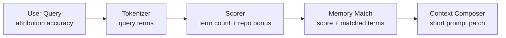

# Codex AGENTS.md 集成演示

这份 demo 用来证明 v0.3 的核心闭环：

```text
AGENTS.md 触发规则
  -> Codex 自然语言识别 recall / remember
  -> MemAgent 本地写入和召回 memory
  -> 短上下文拼给 Codex
```

示例全部使用 mock 工程信息，适合公开演示。

## 1. 准备隔离的 demo memory home

在 MemAgent 项目根目录运行：

```bash
mkdir -p local_memory_demo/agents_flow
```

后续命令都使用：

```bash
MEMAGENT_HOME=local_memory_demo/agents_flow PYTHONPATH=src python -m memagent.cli ...
```

这样不会污染你真实的 `~/.memagent`。

## 2. 生成 AGENTS.md snippet

```bash
PYTHONPATH=src python -m memagent.cli agents-snippet
```

演示重点：

- 输出里有 recall 触发语，比如 `召回一下相关记忆`。
- 输出里有 remember 触发语，比如 `沉淀一下`。
- recall 命令带 `--show-sources --show-reasons`，能展示来源和命中原因。
- 安全规则说明 local private memory 和 public demo 的边界。

## 3. 模拟新线程：第一次 recall 没有记忆

```bash
MEMAGENT_HOME=local_memory_demo/agents_flow PYTHONPATH=src python -m memagent.cli recall \
  "召回一下相关记忆，我要排查 demo 服务的 attribution accuracy" \
  --show-sources --show-reasons
```

预期会看到：

```text
[MemAgent recalled context]
- No related memories found.
```

这一步对应真实 Codex 场景：

```text
用户：召回一下相关记忆，我要排查 demo 服务的 attribution accuracy
Codex：按 AGENTS.md 调用 memagent recall
```

## 4. 模拟沉淀一条 workflow memory

```bash
MEMAGENT_HOME=local_memory_demo/agents_flow PYTHONPATH=src python -m memagent.cli remember \
  --domain coding \
  --kind data_entrypoint \
  --repo demo_service \
  --module attribution \
  --topic "Demo attribution accuracy entrypoint" \
  --trigger attribution \
  --trigger accuracy \
  --trigger audit_label \
  "For demo attribution accuracy checks, start from the audit_label snapshot table, sample by primary-key ranges, then compare model output with human-reviewed labels. Avoid full-table JSON aggregation before sampling."
```

这一步对应真实 Codex 场景：

```text
用户：沉淀一下，下次查 attribution accuracy 先从 audit_label 快照入口开始
Codex：总结短 memory，调用 memagent remember
```

## 5. 再次 recall：看到来源和命中原因

```bash
MEMAGENT_HOME=local_memory_demo/agents_flow PYTHONPATH=src python -m memagent.cli recall \
  "先看看之前有没有 attribution accuracy 的相关经验" \
  --show-sources --show-reasons
```

预期输出包含：

```text
- Memory: Demo attribution accuracy entrypoint [coding/data_entrypoint] (...memory.yaml) | score=...
```

`matched=...` 会展示 query 命中的词，例如 `attribution`、`accuracy`。

这就是 v0.3 新增的可解释召回能力：



## 6. 演示 Codex prompt patch

不真正启动 Codex，只看拼出来的 prompt：

```bash
MEMAGENT_HOME=local_memory_demo/agents_flow PYTHONPATH=src python -m memagent.cli codex \
  --dry-run \
  --show-sources \
  --show-reasons \
  "我要继续排查 demo 服务 attribution accuracy，先给我一个排查计划"
```

预期结构：

```text
[MemAgent recalled context]
- Task: ...
- Context: ...
- Memory: Demo attribution accuracy entrypoint [coding/data_entrypoint] (...) | score=...
  - ...

[User task]
我要继续排查 demo 服务 attribution accuracy，先给我一个排查计划
```

这一步是面试演示的关键画面：MemAgent 没有替代 Codex，而是给 Codex 注入一段短、可解释、来源明确的 workflow memory。

## 7. Demo 讲解词

可以这样讲：

> 我做的不是一个通用 agent，而是 coding agent 的 workflow memory layer。用户在 Codex 里说“召回一下相关记忆”，Codex 根据 AGENTS.md 调用 MemAgent；MemAgent 从本地 memory card 里检索相关的工具入口、失败路径和验证方式，并把短上下文拼到 Codex prompt 前。召回结果会带来源和命中原因，所以它比黑盒记忆更可控。

## 8. 清理 demo 数据

```bash
rm -rf local_memory_demo/agents_flow
```

`local_memory_demo/` 已经被 Git 忽略，不会提交到远端。

