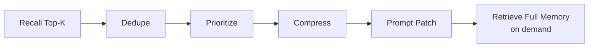

# v0.10 竞品扫描与定位校准

## 1. 背景

这次调研来自一个产品判断：vibe coding 前可以先在 GitHub 找类似项目，直接复用或改造会省很多时间。对 MemAgent 来说，这一步很必要，因为“coding agent memory”已经有不少项目在做。

调研后发现，MemAgent 的方向不能只停在：

```text
remember / recall / MCP / RAG
```

这些能力本身已经不稀缺。更有价值的定位是：

```text
Codex-first workflow memory lifecycle
```

即：围绕 Codex 真实开发线程，把工具 recipe、失败路径、数据入口、验证方式沉淀成可解释、可编辑、可召回、可评估的工程工作流记忆。

## 2. 对标项目

| 项目 | 关系 | 值得学什么 |
|---|---|---|
| [agentmemory](https://github.com/rohitg00/agentmemory) | 直接竞品 | hooks capture、BM25/vector/graph fusion、SessionStart 注入、memory evolution、observability |
| [ai-memory](https://github.com/akitaonrails/ai-memory) | 直接竞品 | handoff、catch-me-up、per-cwd routing、session boundary capture、read-only memory view |
| [Hindsight](https://github.com/vectorize-io/hindsight) / [Redis Agent Memory Server](https://github.com/redis/agent-memory-server) | memory service | LLM/provider 抽象、working/long-term memory、HTTP/MCP、hybrid search |
| [mcp-memory-keeper](https://github.com/mkreyman/mcp-memory-keeper) / [memory-mcp](https://github.com/yuvalsuede/memory-mcp) | Claude 记忆桥 | PreCompact/SessionEnd、CLAUDE.md brief、MCP recall、上下文丢失恢复 |
| [Headroom](https://github.com/headroomlabs-ai/headroom) | 相邻能力 | token-aware context compression、CCR retrieve-on-demand、wrap Codex、learn 写 AGENTS.md |
| [ByteRover CLI](https://github.com/campfirein/byterover-cli) | 大而全平台 | context tree、review workflow、cloud sync、多 agent support |
| [Basic Memory](https://github.com/basicmachines-co/basic-memory) | 本地知识层 | Markdown source of truth、SQLite index、MCP behavior hints、schema validate |
| [Mem0](https://github.com/mem0ai/mem0) / [LangMem](https://github.com/langchain-ai/langmem) | 通用 memory SDK | LLM extraction、background consolidation、semantic/BM25/entity retrieval、benchmark |
| [Serena](https://github.com/oraios/serena) / [codebase-memory-mcp](https://github.com/DeusData/codebase-memory-mcp) / [NeuralMind](https://github.com/dfrostar/neuralmind) | coding-agent IDE 工具 | symbol-level code retrieval、code knowledge graph、token-aware codebase context |

## 3. 关键判断

### 3.1 不要做 agentmemory-lite

如果 MemAgent 只是加上：

- MCP server
- vector search
- hooks
- dashboard

那面试时很容易被问：“这和 agentmemory / ai-memory 有什么区别？”

更好的回答是：

> 我先把范围收窄到个人 Codex 工程流，重点解决真实线程里的工具经验复用。相比通用 memory backend，MemAgent 的 memory card 更偏 workflow object，包括适用范围、触发词、工具 recipe、失败路径、验证方式和下一步提示。召回结果不是一个普通知识片段，而是可以直接进入 Codex prompt 的短 action context。

### 3.2 Headroom 更适合做后续增强层

Headroom 的启发是：memory 不是越多越好。未来 MemAgent 需要一个 context packing 层：



这能把 MemAgent 从“RAG 检索器”往“coding-agent context engineering layer”推进。

### 3.3 Basic Memory 证明本地文件路线成立

MemAgent 不必急着引入复杂数据库。当前 memory card 文件作为 source of truth 是合理的：

- 方便用户查看和编辑。
- 方便 Git diff / backup / export。
- index 可以随时重建。
- 私有 exact memory 与公开 generalized memory 可以分目录管理。

后续可以补 SQLite/FTS/vector index，但不要让 index 变成唯一真相。

## 4. 下一步产品路线

推荐后续迭代顺序：

1. **capture / handoff**
   从手动 `remember` 走向“本轮结束时产出 handoff draft”，让新会话能问 `where did we leave off?`。

2. **memory draft review**
   引入 LLM extraction，但默认生成 draft，不自动写入长期 memory。用户确认后再保存。

3. **context packing**
   对召回结果做去重、排序、压缩和 token budget 控制。

4. **MCP tool annotations**
   让 MCP tools 明确哪些是 read-only、哪些会写入 memory，降低 coding agent 误用概率。

5. **evaluation loop**
   扩展 `recall-eval`，从 mock benchmark 走向匿名化真实 workflow case set。

## 5. 面试讲法

可以这样讲项目差异：

> 我调研过 agentmemory、ai-memory、Mem0、LangMem、Headroom、Basic Memory 等项目。我的判断是，长期记忆本身已经不是新东西，所以 MemAgent 不追求做又一个通用 memory server，而是主攻 Codex 工程工作流。它把排查线程中验证过的工具 recipe、失败路径和验证口径沉淀成 workflow memory card，通过 AGENTS.md/MCP 自然触发，用 BM25/后续 hybrid recall 做检索，并通过 `recall-eval` 把召回质量变成可度量指标。

这套讲法能覆盖：

- agent integration
- RAG / retriever
- MCP
- memory lifecycle
- context compression
- evaluation
- local-first privacy

也能解释为什么这个项目不是简单封装别人的 repo。
