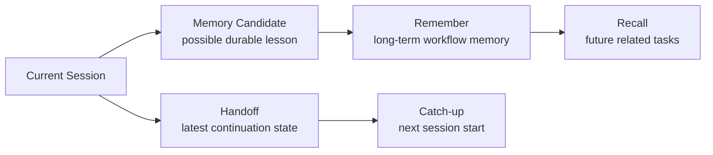

# v0.11 Handoff / Catch-up 设计

## 1. 背景

竞品扫描后，一个很明确的方向是：MemAgent 不能只做长期 memory card，还要解决 coding agent 新会话开始时的“我上次做到哪了？”。

长期 memory 和 handoff 的区别：

| 类型 | 解决什么 | 生命周期 |
|---|---|---|
| memory card | 可复用工程经验，比如工具 recipe、坑、验证方式 | 长期保存，可召回、可评估、可升格 AGENTS.md |
| handoff | 最近一次线程的继续状态，比如已完成、下一步、开放问题 | 每个项目保留 latest，同时写 history |

所以 v0.11 加的是一个轻量但可扩展的 handoff 层。

## 2. 目标

第一版只做本地可验证闭环：

```text
memagent handoff save
  -> 写入 ~/.memagent/handoffs/<project-key>/latest.md
  -> 同步写入 history/handoff_<timestamp>.md

memagent handoff show
  -> 读取当前项目 latest.md
  -> 输出短 catch-up context
```

它先不做：

- 自动 hook。
- LLM 自动总结。
- 从 Codex 原始日志抽取。
- 多用户共享。

这些后续都可以接在 `handoff save` 前面。

## 3. 数据模型

handoff 使用 Markdown 文件，不进入 `memories/`：

```text
~/.memagent/
  handoffs/
    <repo>-<path-hash>/
      latest.md
      history/
        handoff_20260704_....md
```

`<path-hash>` 来自 git root 或 cwd，避免两个同名项目互相覆盖。

每个 handoff 包含：

- topic
- metadata
- summary
- done
- next steps
- open questions
- memory candidates

`memory_candidates` 是很关键的分层：有些内容只是本次交接，有些内容可能值得后续用 `remember` 沉淀成长期 memory。第一版先记录候选，不自动提升。

## 4. AGENTS.md 自然语言触发

新增 catch-up 触发：

```text
上次做到哪
接着上次继续
catch me up
where did we leave off
```

Codex 应调用：

```bash
memagent handoff show
```

新增交接保存触发：

```text
交接一下
记录当前进展
下次接着做
保存一个 handoff
```

Codex 应先总结当前线程，再调用：

```bash
memagent handoff save \
  --topic "<short topic>" \
  --done "<completed item>" \
  --next-step "<recommended next step>" \
  --open-question "<open question if any>" \
  --memory-candidate "<possible durable lesson if any>" \
  "<short handoff summary>"
```

## 5. 和 Memory Card 的关系



设计原则：

- handoff 保存“这次做到哪”，不要求长期正确。
- memory card 保存“以后类似问题怎么做”，要求可复用。
- handoff 可以包含 memory candidates，但不自动污染长期 memory。

## 6. 面试讲法

可以这样讲：

> 我把 memory lifecycle 拆成 recent continuation 和 durable workflow memory。handoff 解决新会话恢复状态的问题，memory card 解决跨任务复用经验的问题。这样不会把每次线程的临时状态都塞进长期 RAG 语料，同时新会话又能快速 catch up。

这能解释为什么 MemAgent 不是普通 RAG：

- RAG 负责找相关历史。
- handoff 负责恢复最近上下文。
- memory lifecycle 决定哪些内容应当长期保存，哪些只适合做一次交接。
