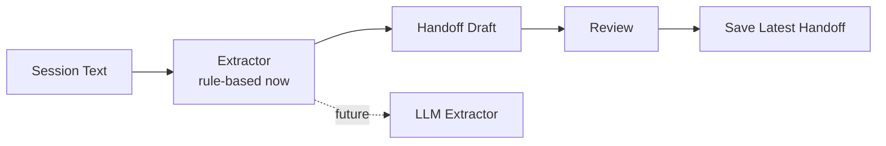

# v0.12 Handoff Draft 设计

## 1. 背景

v0.11 已经有 `handoff save/show`，但直接保存仍然依赖 Codex 一次性总结正确。为了避免“自动乱存”，v0.12 增加 draft-first 流程：

```text
session notes / transcript
  -> handoff draft
  -> user review
  -> handoff save
```

这让 MemAgent 更接近真实 memory lifecycle：先生成候选，再确认写入。

## 2. 命令

只生成草稿：

```bash
memagent handoff draft --from-file ./session_notes.md
```

生成并保存：

```bash
memagent handoff draft --from-file ./session_notes.md --save
```

当前版本是 deterministic parser，不调用大模型。它会优先识别 Markdown section：

- `Summary`
- `Done`
- `Next Steps`
- `Open Questions`
- `Memory Candidates`

如果没有这些 section，再用关键词做兜底抽取。

## 3. 为什么先不用 LLM

第一版不接 API，是为了把产品闭环先跑稳：

- 不需要 API key。
- 测试可重复。
- demo 可稳定生成。
- 后续可以把规则 parser 替换成 LLM extractor。

接口设计上保留了替换空间：



## 4. 和长期 Memory 的关系

`handoff draft` 会生成 `memory_candidates`，但不会自动写入 `memories/`。

原因：

- handoff 是最近状态。
- memory card 是长期可复用经验。
- 自动把所有候选写入长期 RAG 语料会引入噪声。

后续可以增加：

```bash
memagent memory promote --from-handoff latest
```

或者在 Codex 中自然语言触发：

```text
把这个 handoff 里的第二条 memory candidate 沉淀成长期 memory
```

## 5. 面试讲法

可以这样讲：

> 我没有让 agent 直接把整段线程写进长期记忆，而是设计成 draft-review-save。第一版 extractor 是规则实现，保证可测试和可演示；后续可以替换成 LLM extraction。这个设计把 agent memory 的 capture 阶段拆出来，避免记忆污染，也为之后的 memory promotion、conflict detection 和 evaluation 留出接口。
