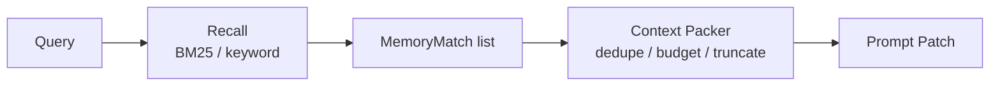

# MemAgent v0.15 Context Packing Design

## 1. Goal

Upgrade recall output from "top-k memory lines" to a small context pack that is
safe to prepend to a coding-agent prompt.

The context pack should:

- keep source and scoring explanations when requested
- dedupe repeated advice across memories
- respect a small line and character budget
- mark when content was truncated
- avoid changing the existing `remember`, `recall`, `codex`, AGENTS.md, or MCP
  command surfaces

## 2. Why This Matters

RAG quality is not only retrieval quality. A coding agent can still fail if the
retrieved memories are noisy, repetitive, or too long.

Headroom is a useful adjacent reference here: the important idea is not "store
more context", but "pack the right context into the prompt budget".

MemAgent's version is intentionally local and simple:

```text
BM25 MemoryMatch list
  -> preserve score/source/reason
  -> dedupe repeated memory lines
  -> fit into line/char budget
  -> emit prompt-ready context pack
```

## 3. Output Shape

Recall now includes a pack summary:

```text
[MemAgent recalled context]
- Task: ...
- Context: cwd: ...; repo: ...
- Pack: 2/5 memories; budget=8 memory lines/1200 chars; deduped=1; truncated=yes
- Memory: ...
  - ...
```

Fields:

- `2/5 memories`: how many retrieved memories actually fit into the prompt pack.
- `budget`: the memory-line and character budget used by the packer.
- `deduped`: repeated advice lines removed from lower-ranked memories.
- `truncated`: whether some retrieved content did not fit.

## 4. Implementation

The packer lives inside `memory.py`:

- `MemoryStore.recall(...)` still returns ranked `MemoryMatch` objects.
- `MemoryStore.compose_context(...)` now calls `_pack_memory_matches(...)`.
- `_pack_memory_matches(...)` handles dedupe, line budget, char budget, and
  truncation.

This keeps the retrieval layer and context-composition layer separate:



## 5. Interview Angle

This is the step that moves MemAgent beyond "I built a RAG":

> I separated retrieval from context packing. The retriever ranks workflow
> memory cards, while the packer decides what is safe and useful to inject into
> the coding-agent prompt under a small budget. The output is explainable: it
> shows sources, matched terms, dedupe count, and whether the pack was truncated.

That makes the project easier to discuss as a context-engineering system rather
than only a keyword search tool.

## 6. Future Extension

Later versions can replace the simple character-budget proxy with:

- tokenizer-aware token budgets
- memory-kind-specific composers
- vector + BM25 hybrid candidates before packing
- LLM summarization for oversized memory cards
- retrieve-on-demand links to full memory cards

