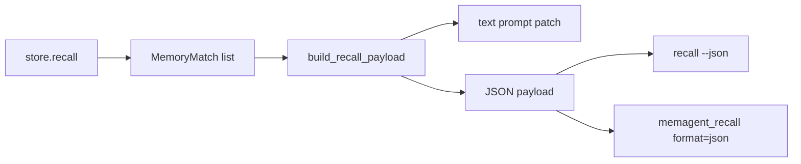

# MemAgent v0.16 Structured Recall Design

## 1. Goal

Add a stable, agent-consumable recall payload without changing the default human
readable recall output.

New surfaces:

```bash
memagent recall "attribution accuracy" --json
```

MCP:

```json
{
  "name": "memagent_recall",
  "arguments": {
    "query": "attribution accuracy",
    "format": "json"
  }
}
```

## 2. Why This Matters

Plain text is good for Codex-in-the-loop demos and manual debugging, but it is
fragile for future automation:

- another coding agent has to infer fields from Markdown
- tests cannot easily assert the exact recalled cards and pack metadata
- future UI/MCP/plugin surfaces need a contract stronger than text

v0.16 introduces a `memagent.recall.v1` payload:

```json
{
  "schema_version": "memagent.recall.v1",
  "query": "...",
  "context": {
    "cwd": "...",
    "git_root": "...",
    "branch": "main",
    "repo_name": "project"
  },
  "total_matches": 1,
  "matches": [],
  "pack": {},
  "text": "[MemAgent recalled context]..."
}
```

The `text` field keeps the prompt-ready fallback, while `matches` and `pack`
give agents stable fields for routing, logging, UI, and evaluation.

## 3. Implementation

The core method is:

```python
MemoryStore.build_recall_payload(...)
```

`MemoryStore.compose_context(...)` now calls `build_recall_payload(...)` and
returns `payload["text"]`. That keeps the text behavior unchanged while making
structured output the underlying contract.



## 4. Payload Fields

| Field | Meaning |
|---|---|
| `schema_version` | Contract identifier. Current value: `memagent.recall.v1`. |
| `query` | User task/query passed to recall. |
| `context` | Detected cwd, git root, branch, repo name, recent files, AGENTS files. |
| `total_matches` | Number of ranked memory matches before context packing. |
| `matches` | Ranked memory cards with score, source file, domain/kind, matched terms, and extracted lines. |
| `pack` | Context packing result: emitted matches, budget, dedupe count, truncation, packed lines. |
| `text` | Human-readable prompt patch, same shape as normal recall output. |

## 5. Interview Angle

This makes the project more than a CLI demo:

> I kept a human-readable recall output for AGENTS.md/Codex, but introduced a
> versioned structured recall contract underneath it. This lets other agents,
> MCP clients, evaluations, or a future UI consume the same recall result without
> scraping Markdown.

It also gives a clear path for future agentic behavior:

- log recall payloads for recall quality analysis
- let MCP clients render matched cards and pack metadata
- feed only `payload["text"]` into Codex while storing full `matches`
- compare retriever/reranker changes against the same JSON schema
