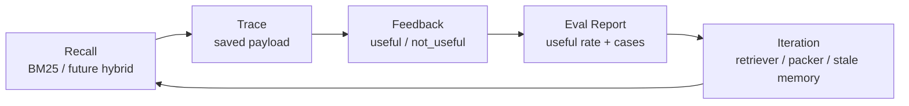

# MemAgent v0.20 Trace Feedback Evaluation Design

## 1. Goal

Turn real labeled recall traces into a durable Markdown evaluation artifact.

New command:

```bash
memagent trace eval
```

Default output:

```text
local_memory_demo/trace_eval/report.md
```

## 2. Why This Matters

`recall-eval` is a mock benchmark: it proves the retriever can rank known
export-safe examples. `trace report` is a quick console summary: it proves users
can label whether a real recall helped.

`trace eval` connects those two ideas:

```text
recall --trace
  -> trace label useful / not_useful / neutral
  -> trace report for quick signal
  -> trace eval for reviewable Markdown evidence
```

This makes the evaluation story more credible for interviews because MemAgent
can show both:

- offline retrieval metrics from controlled mock cases
- real-use feedback metrics from actual Codex sessions

## 3. Report Shape

The report uses trace metadata only. It does not copy full recalled context,
memory card bodies, or raw trace JSON.

Sections:

- workspace and memory home
- traces inspected
- labeled / unlabeled count
- useful / not_useful / neutral count
- useful rate based on labeled traces
- per-trace table with query, repo, top match, rating, note, and matched terms

## 4. CLI Behavior

```bash
memagent trace eval
memagent trace eval --workspace local_memory_demo/trace_eval --limit 50
```

Console output is intentionally short:

```text
[MemAgent trace-eval]
- workspace: ...
- memory home: ...
- report: ...
- traces inspected: 3
- labeled: 2
- useful_rate: 0.50
```

The detailed artifact is written to `report.md`.

## 5. MCP Behavior

MCP exposes the same capability as `memagent_trace_eval`.

It is not marked read-only because it writes a report file. It is marked
non-destructive and idempotent because it only rewrites a local Markdown report
from the current trace set.

## 6. Interview Angle

The key framing:

> MemAgent does not stop at RAG recall. It records real recall traces, lets the
> user label whether the recall helped, and turns that feedback into a report.
> That creates an observable loop for improving retrievers, context packing, and
> memory lifecycle decisions.

This supports a concrete system story:



## 7. Future Extension

- replay traces against multiple retrievers
- compare BM25, vector, reranker, and context-packing variants
- flag stale memories when many traces are `not_useful`
- suggest promotion when a memory is repeatedly useful
- add a small browser UI for trace review
