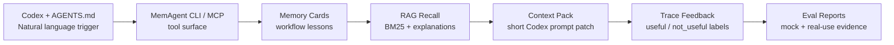

# MemAgent v0.21 Interview Demo Bundle Design

## 1. Goal

Generate one shareable entrypoint for the MemAgent interview demo.

New command:

```bash
memagent demo-bundle --reset
```

Default output:

```text
local_memory_demo/demo_bundle/interview_demo.md
```

## 2. Why This Matters

MemAgent already has the individual proof points:

- AGENTS.md natural-language integration
- BM25-style recall with sources and matched terms
- Codex prompt patch
- handoff / promotion lifecycle
- MCP tool surface
- mock `recall-eval`
- real-use `trace eval`

But in an interview, jumping between many commands and files is noisy. The demo
bundle creates one Markdown entrypoint that links the generated artifacts and
explains what each artifact proves.

## 3. Bundle Contents

`demo-bundle` creates:

```text
local_memory_demo/demo_bundle/
  interview_demo.md
  agents_flow/
    transcript.md
    trace_eval/report.md
    project/AGENTS.md
  recall_eval/
    report.md
```

`interview_demo.md` contains:

- artifact table
- Mermaid system story
- capability evidence table
- MCP tool surface table with read-only/idempotent annotations
- five-minute demo script
- positioning summary

## 4. System Story



## 5. Design Choice

`demo-bundle` does not invent new memory behavior. It orchestrates existing
commands and reports:

- `demo-run` for AGENTS.md / Codex flow
- `recall-eval` for mock retriever metrics
- `trace eval` from the demo trace for real-use feedback evidence
- MCP `tool_definitions()` for protocol surface evidence

This keeps the demo honest: the report is a view over runnable behavior, not a
handwritten marketing page.

## 6. Interview Angle

Use `demo-bundle` to say:

> I can show this project as a system, not just a CLI. The generated bundle
> proves the Codex integration path, the RAG retrieval path, the MCP protocol
> surface, and the feedback/evaluation loop from one reproducible mock run.

It also lets the interviewer inspect generated artifacts rather than trusting a
live demo that depends on timing.

## 7. Future Extension

- optional static HTML export
- side-by-side screenshots for README
- MCP stdio transcript capture
- multiple retriever comparison in the bundle
- anonymized real private trace bundle for personal review
