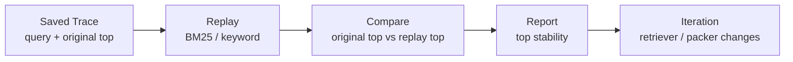

# MemAgent v0.23 Trace Replay Evaluation Design

## 1. Goal

Replay saved recall trace queries against the current retrievers and write a
Markdown regression report.

New command:

```bash
memagent trace replay
```

Default output:

```text
local_memory_demo/trace_replay/report.md
```

## 2. Why This Matters

`trace eval` answers:

> Did the user label past recall results as useful?

`trace replay` answers a different question:

> If I replay the same trace queries after changing retrieval logic, does the
> top memory stay stable, especially for traces that were labeled useful?

This makes RAG iteration more concrete. MemAgent can now use real traces as a
lightweight regression suite instead of relying only on a mock benchmark.

## 3. Report Metrics

The report compares the original trace top match with the replayed top match.

- `top_stability`: fraction of traces where replay top equals original top.
- `useful_top_stability`: same check, but only for traces labeled `useful`.

These are not human relevance metrics. They are regression signals for retriever
and context-packing changes.

## 4. Flow



## 5. CLI Behavior

```bash
memagent trace replay
memagent trace replay --workspace local_memory_demo/trace_replay --limit 50
```

Console output:

```text
[MemAgent trace-replay]
- workspace: ...
- memory home: ...
- report: ...
- traces inspected: 3
- bm25: top_stability=1.00; useful_top_stability=1.00
- keyword: top_stability=0.67; useful_top_stability=0.50
```

## 6. MCP Behavior

MCP exposes the same capability as `memagent_trace_replay`.

It writes a local report, so it is not read-only. It is non-destructive and
idempotent because rerunning it rewrites the report from the current trace set.

## 7. Interview Angle

Use this when explaining how MemAgent goes beyond a static RAG demo:

> I save real recall traces, collect user feedback, and then replay those traces
> against retriever changes. That gives me a lightweight regression signal:
> whether useful historical recalls still return the same top memory after I
> change scoring or context packing.

## 8. Future Extension

- replay against vector and reranker strategies
- compare prompt-pack variants, not only retriever variants
- fail CI when useful top stability drops below a threshold
- export anonymized trace replay suites for public demos
