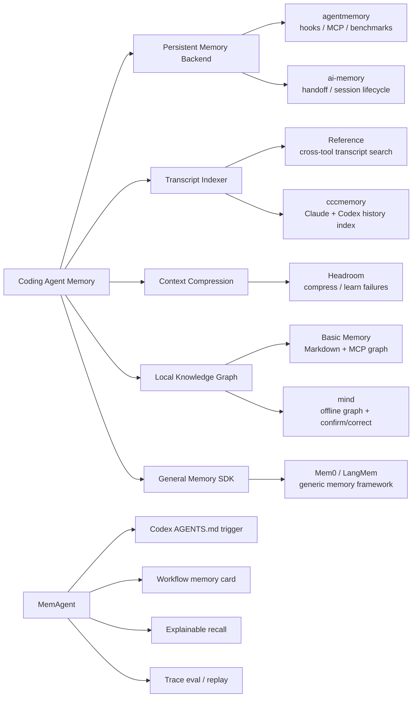
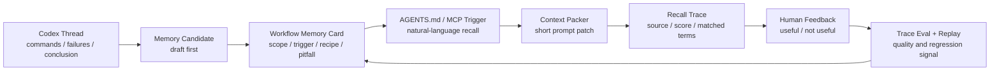
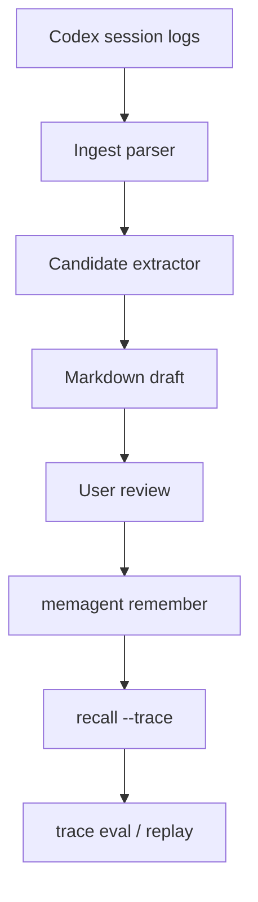

# MemAgent v0.24 Landscape Refresh

调研日期：2026-07-04

这次调研来自一个很实际的判断：vibe coding 前先在 GitHub 搜同类项目，很多时候能直接复用思路，避免闭门造车。

结论很明确：**coding agent memory 已经很热，MemAgent 不能只讲 remember / recall / MCP / RAG。** 更好的方向是把范围收窄到 Codex-first 的工程工作流记忆，并把“真实线程经验 -> 短上下文注入 -> 反馈评估 -> 迭代”的闭环做扎实。

## 1. 项目地图



## 2. 最接近的项目

| 项目 | 当前定位 | 可以学什么 | MemAgent 不应照抄什么 |
|---|---|---|---|
| [agentmemory](https://github.com/rohitg00/agentmemory) | 面向 Claude Code、Codex、Cursor 等 coding agent 的长期记忆层，包含 MCP、hooks、benchmark、skills、Codex plugin | hooks capture、SessionStart 注入、BM25/vector/graph 混合检索、可观测和 benchmark | 不要做 agentmemory-lite；如果只加 server、hook、vector search，很难讲出差异 |
| [ai-memory](https://github.com/akitaonrails/ai-memory) | 长期记忆 + 跨 agent handoff；强调 Claude Code 中断后可在 Codex 同目录继续 | lifecycle hooks、session boundary、per-project routing、handoff block、LLM opt-in | 不要一开始变成常驻 server / 多用户 wiki；我们先打穿个人 Codex 工程流 |
| [Reference](https://github.com/kuberwastaken/reference) | MCP server，读取 Claude/Codex/Cursor 等本地 transcript 和 memory 文件，让 agent 互查历史 | transcript adapter、read-only local index、recall evidence、Codex/Claude history 互通 | 它更像历史搜索引擎；MemAgent 要把搜索结果转成可沉淀的 workflow memory |
| [cccmemory](https://github.com/xiaolai/cccmemory) | 已归档的 Claude/Codex conversation indexer，支持 decision/mistake、handoff、hybrid search | 解析 `~/.codex/sessions`、mistake/decision 抽取、质量标签、stale/duplicate 维护 | 不要把 session 全量搜索当最终产品；搜索只是 memory candidate 的入口 |
| [Headroom](https://github.com/headroomlabs-ai/headroom) | context compression layer，压缩 tool output、logs、RAG chunks、files、conversation，并支持 MCP/proxy | token-aware compression、failure learning、agent wrapper、AGENTS.md/CLAUDE.md correction 写回 | MemAgent 不是压缩器；更适合把它的思路用于 prompt patch 压缩和失败路径沉淀 |
| [Basic Memory](https://github.com/basicmachines-co/basic-memory) | local-first Markdown knowledge graph + MCP server，支持 Claude/Codex/Cursor/VS Code 等 | Markdown source of truth、SQLite index、tool annotations、agent skills、cloud/local 双形态 | MemAgent 不应变成通用个人知识库；工程 recipe 和验证方式才是主线 |
| [mind](https://github.com/Da7-Tech/mind) | 单文件、离线、零依赖的 coding-agent memory，使用概念图、confirm/correct/dream | provenance、confirm/correct、forgetting/consolidation、可解释 recall | 不必模仿脑科学叙事；可以借鉴“显式确认有效记忆”的反馈动作 |

## 3. 产品判断

### 3.1 只做通用长期记忆没有优势

现在已经有项目直接覆盖：

- Codex / Claude Code / Cursor 多 agent 记忆。
- MCP server。
- hooks 自动捕获 prompt、tool call、session lifecycle。
- BM25 / vector / graph / RRF 检索。
- handoff / catch-me-up。
- Markdown wiki / web viewer。

所以 MemAgent 面试时不能只说“我做了一个跨会话 memory”。这个说法会被追问：和 agentmemory / ai-memory / Basic Memory 有什么区别？

更好的回答是：

> 我做的是 Codex-first 的 engineering workflow memory。它不是保存所有聊天历史，而是把真实排查线程里的工具 recipe、失败路径、数据入口、验证口径和下一步动作，沉淀成可编辑、可解释、可评估的短上下文资产。

### 3.2 MemAgent 的差异点要压在 workflow lifecycle

MemAgent 应该重点讲这条链：



这套故事比“RAG 搜索历史”更强，因为它覆盖：

- agent integration：AGENTS.md 自然语言触发、MCP stdio。
- RAG：BM25 / keyword baseline、explainable recall、context packing。
- memory lifecycle：remember、handoff、promote、stale/duplicate/conflict 方向。
- feedback loop：trace label、trace eval、trace replay。
- demo：demo-bundle、mcp-demo、JSON-RPC transcript。

### 3.3 本地私有精确记忆是优势

对你自己的场景，很多真正有价值的经验不是“泛化摘要”，而是：

- bytedcli 某类任务应该怎么查。
- 某个服务对应哪个库、哪个表、哪个 API path。
- 某类排查先看哪个字段、哪个状态、哪个 owner 配置。
- 上次哪个方向绕远了，下次应该跳过。

这些信息不适合提交到公开 repo，但适合保存在 `~/.memagent/` 的 private memory。公开 demo 再使用 mock/generalized memory。

这也是 MemAgent 和很多通用 memory backend 的区别：**本地 exact memory 不被弱化，公开展示再脱敏。**

## 4. 可直接复用的设计思路

### 4.1 从 Reference / cccmemory 学 transcript ingest

下一阶段最值得做的是 read-only Codex transcript importer：

```text
~/.codex/sessions/**/*.jsonl
  -> parse turns / tool outputs / final summaries
  -> find candidate lessons
  -> generate memory draft
  -> user review
  -> remember
```

关键是 draft-first，不自动污染长期 memory。这样能解决你现在最真实的痛点：同一个项目换 Codex 线程后，之前跑通的 bytedcli / RDS / BAM 经验又丢了。

### 4.2 从 ai-memory 学 handoff

handoff 不是长期记忆，它更像“下一班接手说明”：

- 当前做到哪。
- 哪些路径试过失败。
- 下一步最应该做什么。
- 哪些 open questions 还没解决。

MemAgent 已经有 `handoff save/show/draft/promote`，后续要把它和 Codex AGENTS.md 触发结合得更自然。

### 4.3 从 Headroom 学 context compression

MemAgent 不需要复制 Headroom，但需要学习它的核心判断：上下文不是越多越好。

后续可以把当前 context packer 升级成：

```text
recall candidates
  -> priority ranking
  -> dedupe
  -> token budget
  -> optional compression
  -> retrieve full memory on demand
```

这能让 MemAgent 从“记忆检索器”变成更像“coding-agent context engineering layer”。

### 4.4 从 Basic Memory / mind 学可审计性

可编辑文件、来源、确认、修正，比黑盒自动记忆更适合个人工程流。

MemAgent 可以继续强化：

- `origin`：这条记忆来自哪个线程 / handoff / 手动输入。
- `confidence`：是否被用户确认有效。
- `validity`：是否已过期、被替代、被纠正。
- `why`：为什么这条 memory 被召回。

## 5. v0.25 建议路线

推荐下一步不要先做花哨 UI，而是做 **Codex transcript ingest + memory candidate review**：



MVP 切法：

1. `memagent ingest codex --limit 5 --dry-run`
2. 读取最近 Codex session 的用户 prompt、assistant final、关键 shell command。
3. 先不用 LLM，基于规则提取“疑似可沉淀片段”，生成 `local_memory_demo/ingest_candidates/*.md`。
4. 用户确认后再 `memagent ingest codex --save-candidates` 或复制到 `remember`。
5. 后续再接 DeepSeek/Qwen/GLM 做 LLM-assisted candidate extraction。

这个方向面试上也更好讲：它连接了真实 Codex 使用、local-first data、RAG candidate generation、human-in-the-loop review、MCP/AGENTS.md integration 和 trace evaluation。

## 6. 面试讲法

可以这样收束：

> 我调研了 agentmemory、ai-memory、Reference、cccmemory、Headroom、Basic Memory、mind 等项目后，发现长期记忆本身已经不是稀缺点。MemAgent 的差异是 Codex-first 的 engineering workflow memory lifecycle：它不保存所有历史，而是把真实开发线程里的工具 recipe、失败路径、数据入口和验证方式沉淀成本地可编辑 memory card；通过 AGENTS.md 和 MCP 在新会话自然召回；再用 recall trace、人工反馈、trace eval 和 trace replay 去评估记忆是否真的有用。

这套讲法能自然覆盖：

- MCP tool design
- RAG / retrieval / context packing
- agent memory lifecycle
- human-in-the-loop review
- local-first privacy
- evaluation / regression testing
- Codex AGENTS.md integration
