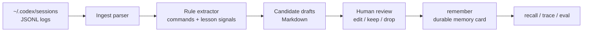

# MemAgent v0.25 Codex Transcript Ingest Design

## 1. Goal

Turn local Codex session logs into review-only memory candidates.

New command:

```bash
memagent ingest codex
```

Default output:

```text
local_memory_demo/ingest_codex/
  report.md
  candidates/
    candidate_001.md
```

This command does not write durable memory cards. It drafts candidates that the
user can review, edit, drop, or manually save with `memagent remember`.

## 2. Why This Matters

The strongest real pain point is not initial memory storage. It is this loop:

> A Codex thread eventually figures out the right tool, table, API, or failed
> path; a new thread starts later and has to rediscover the same thing.

`ingest codex` starts closing that loop by reading existing local Codex session
JSONL files and extracting possible lessons from:

- command records
- command failures
- assistant summaries with lesson signals
- explicit phrases like `记住`, `沉淀`, `下次`, `pitfall`, or `verified`

## 3. Flow



## 4. CLI Behavior

```bash
memagent ingest codex
memagent ingest codex --limit 5 --project-only
memagent ingest codex --sessions-root ~/.codex/sessions --workspace local_memory_demo/ingest_codex
```

Console output:

```text
[MemAgent codex ingest]
- workspace: ...
- sessions root: ...
- sessions scanned: 5
- records scanned: 300
- candidates: 8
- report: .../report.md
- candidates dir: .../candidates
- mode: review-only; no memory cards were written
```

## 5. Candidate Shape

Each candidate has:

- source path and line number
- source type, such as `exec_command` or `message`
- candidate kind, such as `tool_recipe`, `pitfall`, `verification`, or `workflow`
- short memory draft
- evidence snippet
- suggested `memagent remember` command

The suggested command is intentionally a suggestion. The user should edit the
draft before saving if it is too broad, too temporary, or contains data that
should not become durable memory.

## 6. Safety Boundary

`ingest codex` only drafts Markdown candidates. It avoids automatic memory writes
because Codex transcripts can contain:

- raw command output
- internal IDs and paths
- large request/response bodies
- transient debugging context
- secrets accidentally printed by tools

The extractor redacts common secret shapes such as bearer tokens, token query
parameters, password query parameters, cookie headers, and OpenAI-like API keys.
It does not remove ordinary engineering entrypoints such as command names,
database names, table names, or API paths, because those are often the reusable
lesson in the local private memory workflow.

## 7. Interview Angle

This lets MemAgent go beyond manual `remember`:

> I can read previous Codex session logs, extract candidate workflow memories,
> keep the user in the review loop, and only then promote durable lessons into
> memory cards. That connects transcript ingest, RAG recall, human-in-the-loop
> memory editing, and trace-based evaluation.

## 8. Future Extension

- LLM-assisted candidate extraction with DeepSeek/Qwen/GLM/OpenAI-compatible APIs
- direct MCP tool for controlled ingest
- candidate accept/reject metadata
- duplicate/stale/conflict checks before saving
- public-demo generalized export alongside local-private exact candidates
