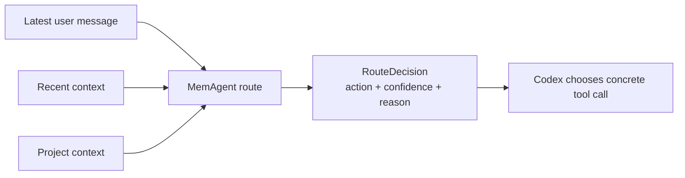

# MemAgent v0.27 LLM-Assisted Router Design

v0.26 把 Codex 交互从工具术语改成自然任务语言。v0.27 继续往前走一步：把“该不该召回、沉淀、标注反馈、交接”的判断抽成一个 router。

## Why

只靠 AGENTS.md 示例会有两个问题：

- 示例容易被误解成硬编码触发词。
- 不同 Codex 线程对自然语言的执行稳定性不同。

Router 的定位是一个只读判断器：



它不直接写 memory，也不直接 label trace。它只告诉 Codex：下一步更像 `recall`、`draft_memory`、`label_feedback`、`handoff_show`、`handoff_save`、`developer_eval` 还是 `none`。

## Contract

CLI:

```bash
memagent route "帮我排查 audit_rule_lib 的 owner 问题，先按你觉得最省时间的方式来" --json
```

MCP:

```text
tools/call memagent_route
```

Schema:

```json
{
  "schema_version": "memagent.route.v1",
  "provider": "heuristic",
  "action": "recall",
  "confidence": 0.82,
  "reason": "The task may benefit from prior coding workflow memory.",
  "signals": ["排查", "owner", "audit_rule_lib"],
  "query": "帮我排查 audit_rule_lib 的 owner 问题，先按你觉得最省时间的方式来",
  "feedback_rating": null,
  "requires_confirmation": false,
  "requires_recent_trace": false,
  "developer_mode": false,
  "suggested_next": "Run recall with --show-sources --show-reasons --strategy bm25 --trace, then verify against live sources.",
  "recent_text_used": false
}
```

## Actions

| Action | Meaning | Concrete next step |
|---|---|---|
| `recall` | Task may benefit from prior workflow memory | Run recall with trace, then verify live sources |
| `draft_memory` | Current thread has a reusable lesson | Preview topic/kind/triggers/memory, ask confirmation |
| `label_feedback` | User is saying recalled memory helped or failed | Label latest trace if one exists |
| `handoff_show` | User wants to resume previous state | Show latest handoff |
| `handoff_save` | User wants to stop or continue elsewhere | Save handoff summary |
| `developer_eval` | User is evaluating MemAgent itself | Run trace eval/replay with explicit workspace |
| `none` | No memory action is useful | Continue normally |

## Providers

v0.27 ships two provider modes:

- `heuristic`: local deterministic baseline, always available.
- `openai-compatible`: optional API-backed classifier using `MEMAGENT_LLM_BASE_URL`, `MEMAGENT_LLM_API_KEY`, and `MEMAGENT_LLM_MODEL`.

The OpenAI-compatible mode is intentionally generic so it can work with DeepSeek, Qwen, GLM, OpenAI-compatible gateways, or future internal endpoints without changing the route schema.

Example:

```bash
export MEMAGENT_LLM_BASE_URL="https://example.com/v1"
export MEMAGENT_LLM_API_KEY="..."
export MEMAGENT_LLM_MODEL="..."

memagent route "刚刚那条提醒有用" --provider openai-compatible --recent-trace --json
```

## Safety

- `draft_memory` always requires confirmation.
- `label_feedback` requires a recent recall trace.
- `developer_eval` is not normal product flow.
- Router output is a recommendation, not an automatic write.
- Live code, schemas, docs, and command output remain source of truth.

## Interview Point

This turns MemAgent from a prompt-only integration into a small agent policy layer:

> I separated natural interaction detection from concrete memory tools. The router produces a typed decision that can be used by AGENTS.md, CLI, or MCP, with a deterministic baseline and an optional LLM classifier behind the same schema.

