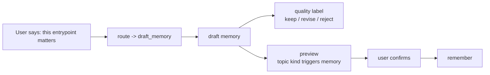

# MemAgent v0.28 Memory Draft Design

v0.27 的 router 能判断“这像是该沉淀 memory”。v0.28 补上下一步：把对话片段或候选经验改写成可审阅的 memory draft。

## Goal

用户不需要知道 `candidate` 或 `remember`。当对话里出现可复用经验时，Codex 可以先生成一个预览：

```bash
memagent draft memory "这个 bytedcli 查 live schema 的入口下次别忘了：..."
```

这个命令只生成 draft，不写长期 memory。保存仍然必须经过用户确认，再调用 `remember`。



## Contract

CLI:

```bash
memagent draft memory "source text" --json
```

MCP:

```text
tools/call memagent_memory_draft
```

Schema:

```json
{
  "schema_version": "memagent.memory_draft.v1",
  "provider": "heuristic",
  "domain": "coding",
  "kind": "data_entrypoint",
  "topic": "data_entrypoint bytedcli rds db table schema ...",
  "triggers": ["bytedcli", "rds", "schema"],
  "memory": "1-3 sentence actionable memory.",
  "quality_score": 0.74,
  "quality_label": "keep",
  "reasons": ["contains reusable tool or command signal"],
  "warnings": [],
  "requires_confirmation": true,
  "suggested_remember": {
    "domain": "coding",
    "kind": "data_entrypoint",
    "topic": "...",
    "triggers": ["bytedcli"],
    "text": "..."
  }
}
```

## Quality Labels

| Label | Meaning | Codex behavior |
|---|---|---|
| `keep` | Looks reusable enough to preview | Show preview and ask whether to save |
| `revise` | Potentially useful but under-specified | Ask user for missing scope or rewrite more tightly |
| `reject` | Not a durable workflow lesson | Do not save; continue normally |

## Providers

v0.28 supports:

- `heuristic`: deterministic local baseline for demos and tests.
- `openai-compatible`: optional model-backed drafting using the same env vars as router.

Required env vars for model-backed drafting:

```bash
MEMAGENT_LLM_BASE_URL
MEMAGENT_LLM_API_KEY
MEMAGENT_LLM_MODEL
```

## Safety

- Drafting never writes memory.
- Drafts always require confirmation.
- Drafts should keep exact local tool recipes when they are the reusable lesson.
- Drafts should not include tokens, passwords, cookies, private keys, long raw outputs, or large business samples.
- `quality_label=reject` is a feature: it prevents ordinary summaries from polluting long-term memory.

## Interview Point

This makes the memory lifecycle more agentic without losing control:

> The agent first routes the interaction, then drafts a structured memory candidate with a quality label, then asks for confirmation before writing. This separates intent detection, memory rewriting, quality control, and durable persistence.

