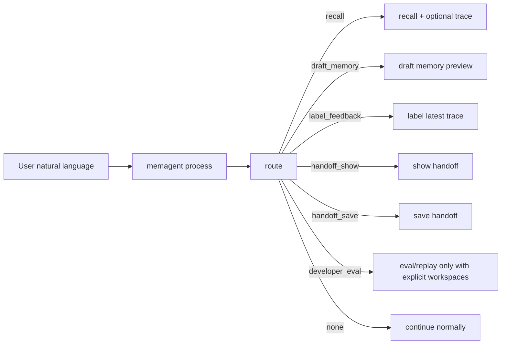

# MemAgent v0.29 Natural Interaction Processor

v0.27 有 `route`，v0.28 有 `draft memory`。v0.29 把它们串成一个面向 Codex 的入口：

```bash
memagent process "latest user message"
```

目标是让 Codex 不必每次手动决定“先 route 再调用哪个命令”。`process` 会先生成 route decision，再执行安全边界内的动作。

The examples in AGENTS.md are semantic calibration examples for Codex or an
LLM provider. They are not meant to become a rigid trigger-word checklist. In
real use, `provider=openai-compatible` should make the interaction-node
judgment feel more natural, while `provider=heuristic` remains the local
offline fallback and regression-test baseline.

## Flow



## Safety Boundary

`process` may write local operational state:

- recall traces
- trace feedback
- handoff state
- explicit developer eval/replay reports

`process` must not write durable long-term memory cards. For memory capture, it only produces a draft with `requires_confirmation=true`; the final save still goes through `remember`.

## Schema

```json
{
  "schema_version": "memagent.process.v1",
  "route": {
    "schema_version": "memagent.route.v1",
    "action": "draft_memory"
  },
  "executed": true,
  "result_text": "[MemAgent memory draft] ...",
  "artifacts": {
    "quality_label": "keep",
    "requires_confirmation": true
  },
  "writes": [],
  "warnings": [],
  "payload": {
    "schema_version": "memagent.memory_draft.v1"
  }
}
```

## Examples

Task start:

```bash
memagent process "帮我排查 audit_rule_lib 的 owner 问题，先按你觉得最省时间的方式来" --json
```

Memory capture:

```bash
memagent process "这个入口下次别忘了" \
  --recent-text "bytedcli rds db table schema demo_db demo_table --region cn" \
  --json
```

Feedback:

```bash
memagent process "刚刚那条提醒有用" --json
```

Handoff:

```bash
memagent process "先到这，下次继续" --from-file session_notes.md --json
```

## Codex Usage

AGENTS.md can now tell Codex:

> When MemAgent may help, call `memagent process "<latest user message>"`. Use lower-level `route`, `draft memory`, `recall`, `trace`, or `handoff` only when you need tighter control.

This makes the normal path feel like one agent memory layer rather than a toolbox of internal commands.
