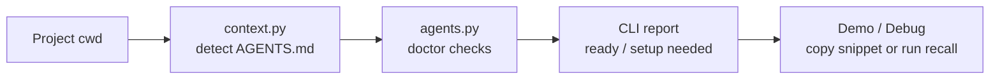

# MemAgent v0.4 AGENTS Doctor Design

v0.4 的目标是让 Codex AGENTS.md 集成不仅“能用”，还“能被检查和展示”。

## 1. 背景

v0.3 已经提供：

```text
agents-snippet -> 复制到 AGENTS.md -> Codex 自然语言触发 recall / remember
```

但真实使用和面试演示时还有一个缺口：

> 用户或面试官看不到当前项目是否真的已经接入 MemAgent。

如果只展示 `recall`，别人会疑惑“Codex 是怎么知道该调用 MemAgent 的”。因此需要一个自检命令，把 AGENTS.md 触发层显式展示出来。

## 2. 目标

新增命令：

```bash
memagent agents-doctor
```

它负责检查：

- 当前 cwd、repo、branch。
- memory home 和 memory card 数量。
- 当前目录向上可见的 `AGENTS.md` / `AGENTS.override.md`。
- AGENTS.md 是否包含 MemAgent 自然语言触发 section。
- 是否包含 `memagent.cli recall` 和 `memagent.cli remember`。
- recall 是否带 `--show-reasons`，支持可解释召回演示。

## 3. 非目标

这一版不做：

- 自动修改 AGENTS.md。
- 自动合并用户已有规则。
- 全局 Codex 配置安装。
- MCP server。
- Hook 自动注册。

原因是自动写入 AGENTS.md 容易误改用户项目规则。当前阶段先做 inspect-only，更安全，也更容易理解。

## 4. Demo 位置

推荐面试演示顺序：

```text
1. memagent agents-doctor
   证明当前项目 AGENTS.md 已经接入 MemAgent

2. memagent recall --show-sources --show-reasons
   展示可解释 RAG-style 召回

3. memagent remember
   展示 coding-agent 经验沉淀

4. memagent codex --dry-run
   展示 prompt patch 如何喂给 Codex
```

## 5. 架构位置



`agents-doctor` 不参与记忆召回主链路，它是 AGENTS.md 集成的可观测性工具。

