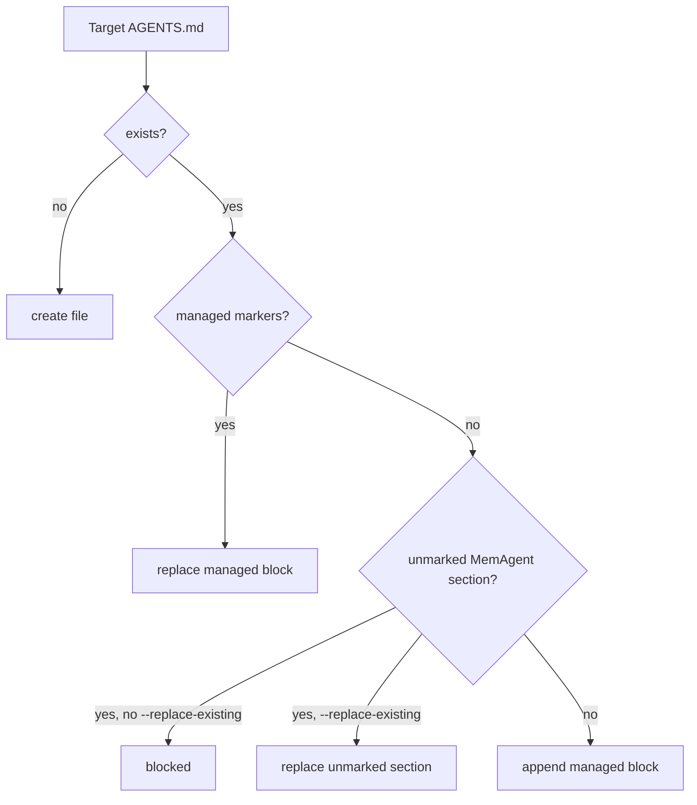

# MemAgent v0.5 AGENTS Install Design

v0.5 的目标是补齐 Codex AGENTS.md 集成的安装闭环：

```text
agents-install -> agents-doctor -> recall / remember -> codex prompt patch
```

## 1. 背景

v0.3 提供 `agents-snippet`，但用户需要手动复制。
v0.4 提供 `agents-doctor`，可以检查是否接入。

剩下的问题是：

> 如果每个项目都要手工复制 snippet，演示和真实使用都不够顺。

因此 v0.5 增加 `agents-install`，负责把 MemAgent snippet 安全写入目标 `AGENTS.md`。

## 2. 设计原则

`agents-install` 必须保守：

- 默认 dry-run，只预览，不写文件。
- 只有显式 `--write` 才落盘。
- 只管理 MemAgent 自己的 Markdown 区块。
- 不重排、不重写用户已有项目规则。
- 遇到旧版无 marker 的 MemAgent section 时默认阻止，避免误删内容。

## 3. 命令形态

预览：

```bash
memagent agents-install
```

写入：

```bash
memagent agents-install --write
```

指定目录：

```bash
memagent agents-install --cwd /path/to/project --write
```

替换旧版无 marker 的 MemAgent section：

```bash
memagent agents-install --replace-existing --write
```

## 4. 安装策略



Managed block markers:

```markdown
<!-- memagent:start -->
...
<!-- memagent:end -->
```

## 5. 面试讲法

这一步可以讲成：

> 我没有让 agent 静默改用户仓库规则，而是做了一个 dry-run-first 的 installer。它用 marker 管理自己的 AGENTS.md section，支持幂等替换，也能检测旧版无 marker section 并阻止风险写入。这体现了 coding-agent 工具集成时的安全边界。

## 6. 后续扩展

后续可以增加：

- `agents-install --global`：安装到用户级 AGENTS.md。
- `agents-install --diff`：输出 unified diff。
- `agents-uninstall`：只删除 managed block。
- `agents-install --profile codex|cursor|claude`：为不同 coding agent 输出不同触发规则。

