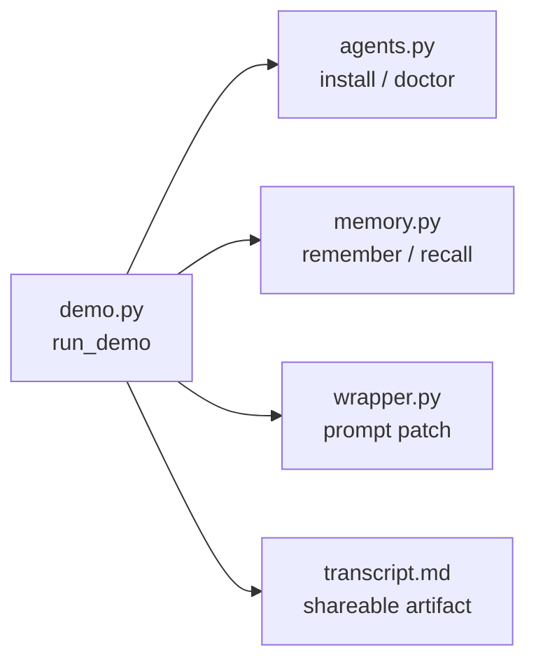

# MemAgent v0.6 Demo Run Design

v0.6 的目标是把已有能力串成一条可复现的面试演示路径。

```text
demo-run
  -> agents-install --write
  -> agents-doctor
  -> remember mock workflow memory
  -> recall --show-sources --show-reasons
  -> codex --dry-run
  -> transcript.md
```

## 1. 背景

v0.3-v0.5 已经分别解决：

- Codex 如何通过 AGENTS.md 自然语言触发 MemAgent。
- 如何检查 AGENTS.md 是否接入。
- 如何安全安装 MemAgent AGENTS.md block。

但演示时如果要手敲多条命令，仍然容易出错，也不方便给面试官看完整效果。因此需要一个一键 demo runner。

## 2. 目标

新增命令：

```bash
memagent demo-run --reset
```

默认写入：

```text
local_memory_demo/demo_run/
  project/
    AGENTS.md
    pyproject.toml
  memagent_home/
    memories/
  transcript.md
```

它只使用 mock 数据，不读取真实工作区 memory，也不依赖外部模型 API。

## 3. Demo Transcript

`transcript.md` 记录每一步：

```text
1. Install MemAgent AGENTS.md block
2. Check AGENTS.md integration
3. Remember a workflow memory
4. Recall with sources and reasons
5. Preview Codex prompt patch
```

每一步都包含：

- 命令。
- 输出。
- 本地路径。

这样面试时可以直接展示 transcript，而不是口头描述。

## 4. 架构位置



`demo-run` 不引入新的核心能力，它是对现有能力的编排层。这个取舍能保持核心逻辑清晰，同时提升演示效果。

## 5. 后续扩展

后续可以把 demo-run 扩展成：

- `--scenario bytedcli-safe-mock`：展示工具 recipe 记忆。
- `--scenario pitfall`：展示失败路径和 next-time prompt。
- `--format html`：生成更适合展示的静态页面。
- `--open`：生成后打开 transcript。

