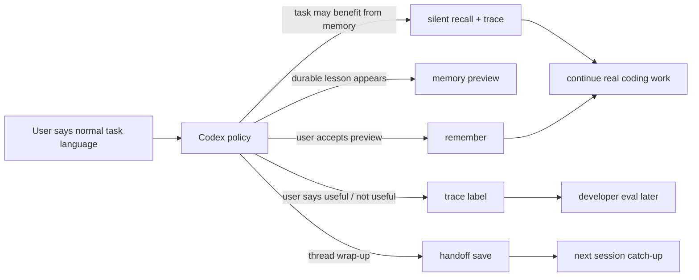

# MemAgent v0.26 Plan: Codex-Native Memory UX

v0.25 自测结论：核心链路能跑通，但用户仍被迫理解 `recall`、`trace`、`eval`、`replay`、`candidate` 等内部概念。v0.26 的目标不是继续堆命令，而是让 MemAgent 更自然地嵌进 Codex 对话。

## 目标

用户只说正常任务语言：

- `帮我排查 audit_rule_lib 的 owner 问题`
- `这个入口下次别忘了`
- `刚刚那条提醒有用`
- `先到这，下次继续`

Codex 根据 AGENTS.md / wrapper / MCP 决定是否调用 MemAgent。用户不需要知道底层发生的是 recall、trace label 还是 handoff save。

## Product Changes

### 1. Task-start memory check

Codex should consider MemAgent before non-trivial coding, debugging, data, or tool-heavy tasks when the prompt mentions repeated domains, tools, repos, data entrypoints, or past failure signals.

Examples:

- `又要查 bytedcli / RDS / owner`
- `继续排查 audit_rule_lib`
- `类似上次那个问题`
- `先按你觉得最省时间的方式来`

Expected behavior:

- Run `memagent recall ... --trace` in the background.
- If memory is useful, summarize it in one short sentence.
- Continue checking live code, schema, docs, command output, and tool results.
- If no memory is found, continue normally.

### 2. Opportunistic memory capture

When a reusable workflow lesson appears, Codex should offer a short memory preview instead of waiting for the user to say `candidate` or `remember`.

Save only after confirmation.

Good preview fields:

- `topic`
- `kind`
- `triggers`
- `memory`

### 3. Feedback from ordinary language

Users should be able to say:

- `这个有用`
- `这条提醒是对的`
- `刚刚那条没帮上忙`
- `这个不相关`

Codex maps this to `trace label` if a recent recall trace exists. The user should not need to know the word `trace`.

### 4. Handoff as thread continuation UX

Handoff is not a memory card. It is a short continuation packet for long or restarted Codex sessions.

Trigger examples:

- `上次做到哪`
- `接着上次继续`
- `先到这`
- `换个会话继续`

### 5. Developer evaluation mode

`trace eval` and `trace replay` should be treated as developer-facing quality reports. They should not be part of the ordinary user path.

Use them when:

- evaluating MemAgent after an iteration
- preparing interview evidence
- comparing retrieval behavior
- checking whether useful traces remain stable

## LLM-Assisted Roadmap

v0.26 keeps the core deterministic and improves the Codex interaction policy first.

v0.27 can add provider adapters for DeepSeek/Qwen/GLM/OpenAI-compatible APIs:

- intent classification: should Codex recall, save, label, or handoff?
- memory drafting: rewrite noisy thread snippets into short memory cards
- quality scoring: reject ordinary summaries that are not reusable workflow lessons
- feedback inference: infer weak positive/negative signals, then ask for confirmation when needed

LLM output should remain reviewable. It drafts and classifies; it should not silently write durable memory.

## Acceptance Criteria

- A normal task prompt can trigger MemAgent recall without the user saying `recall`.
- A normal feedback phrase like `这个有用` can label the latest recall trace.
- A reusable lesson can be previewed and saved without the user knowing about candidate files.
- `trace eval/replay` are documented as developer reports, not daily workflow steps.
- The v0.26 self-test uses natural user prompts instead of command-oriented prompts.

