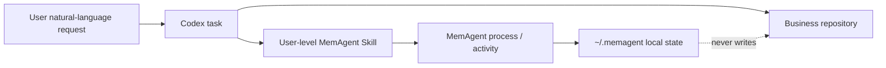

# MemAgent v0.32 Plan: Zero-Intrusion Codex Integration

## Goal

Let MemAgent work from any Codex project directory without modifying that
project's files, `AGENTS.md`, or Git working tree. The user should be able to
speak naturally about prior work, reusable lessons, and daily activity; the
MemAgent integration decides when its local tools are useful.

## Product Boundary

MemAgent is a user-level coding-agent memory layer. It is not an autonomous
desktop agent, a general chatbot, or an alternative project policy system.

The key distinction from `AGENTS.md` is scope:



`AGENTS.md` remains the right place for stable repository rules. MemAgent keeps
dynamic, user-private workflow memory outside the repository.

## v0.32 MVP

### 1. User-Level Skill

`install-user-codex` writes a managed Skill at:

```text
~/.codex/skills/memagent/SKILL.md
```

It embeds the local command that points to the current MemAgent checkout. The
installer is dry-run first, refuses to overwrite an unknown existing skill, and
can be removed with `uninstall-user-codex`.

```bash
PYTHONPATH=src python -m memagent.cli install-user-codex
PYTHONPATH=src python -m memagent.cli install-user-codex --write
PYTHONPATH=src python -m memagent.cli user-codex-doctor
PYTHONPATH=src python -m memagent.cli uninstall-user-codex --write
```

This is the v0.32 replacement for requiring a MemAgent section in every
project's `AGENTS.md`.

### 2. Natural Interaction Contract

Once the user-level Skill is available to a new Codex task, it asks Codex to
use one `process` entrypoint for a memory-relevant task:

```bash
memagent process "<latest user message>"
```

The action can be `recall`, `draft_memory`, `save_memory`, `label_feedback`,
`handoff_show`, or `handoff_save`. `draft_memory` stores a compact pending
preview only; `save_memory` occurs after an explicit natural-language
confirmation and writes that reviewed preview as a durable memory. A no-op does
not create a normal trace.

Examples of ordinary user language:

- "之前这个怎么查？"
- "记住这次踩坑。"
- "确认保存。"
- "刚刚那条有用。"
- "按上次的思路继续。"

The user never needs to say `recall`, `trace`, or `handoff`.

### 3. Project Activity Review

`activity` reads local state and filters it using the current project's Git
root (then cwd, then repo-name fallback). It does not ingest a Codex transcript
and does not mutate the service repository.

```bash
memagent activity --today
memagent activity --cwd /path/to/audit_rule_lib --today
memagent activity --since 2026-07-10 --json
```

The output summarizes process actions, recall feedback, memory cards saved, and
handoffs saved. It draws on:

```text
~/.memagent/process_traces/
~/.memagent/recall_traces/
~/.memagent/memories/
~/.memagent/handoffs/
```

Timestamps remain stored in UTC for machine consistency and are rendered using
the local timezone in the human-readable activity report.

## Verification Story

Use a disposable `CODEX_HOME` in automated tests to prove installation without
touching a real Codex setup. For a real product check:

1. Run `install-user-codex --write` from the MemAgent checkout.
2. Open a new Codex task directly in `audit_rule_lib`; do not edit that repo's
   `AGENTS.md`.
3. Ask a memory-relevant question or ask to preserve a lesson, then run
   `memagent activity --cwd <audit_rule_lib> --today` from any terminal.

Success means the relevant local trace is visible and `git status` inside the
business repository remains unchanged by MemAgent.

## Deliberately Deferred

- A background daemon or universal desktop sidecar.
- Automatic durable-memory writes without confirmation.
- Full transcript capture on every message.
- Cross-project retrieval based only on vague keyword overlap.
- Replacing repository-local `AGENTS.md` policy.

These remain candidates after observing several real development days with the
user-level Skill.
