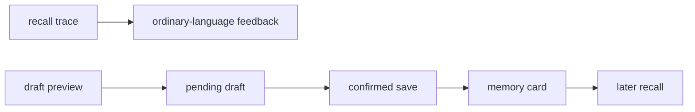

# MemAgent v0.33 Plan: Memory Lifecycle Observability

## Goal

Turn local MemAgent artifacts into a small, project-scoped lifecycle report.
The report explains what happened to memories without judging their quality from
insufficient data.



## Local Evidence

All evidence stays under `~/.memagent/`:

- `recall_traces/`: query, matched card paths, and useful/not-useful feedback.
- `process_traces/`: action, project context, pending-draft ID, confirmed memory
  ID, and memory path.
- `pending_memory_drafts/`: the current unconfirmed draft for a project.
- `memories/`: durable cards and creation time.

`draft_memory` now receives a unique lifecycle ID. `save_memory` records that
same ID beside the new card path, so a report can prove the confirmation chain.

## Product Surface

The existing command remains the only product surface:

```bash
memagent activity --cwd /path/to/project --today
memagent activity --cwd /path/to/project
```

The activity report includes:

- recall count and ordinary-language feedback counts;
- draft total, pending draft count, confirmed count, and observable unconfirmed
  count;
- pending draft topic and waiting time;
- how many project memories were recalled again after they were saved;
- a short recent-event list.

Old v0.32 drafts did not carry a unique confirmation link. They remain visible
as legacy/unlinked evidence rather than being labelled unconfirmed.

## Boundaries

- No vector database, daemon, or desktop agent.
- No automatic durable-memory writes.
- No stale-memory score or quality verdict without a user signal or real history.
- No service-repository files, `AGENTS.md`, or Git mutations.

## What Real Usage Will Decide

After several non-trivial tasks, the report can distinguish these product
questions:

- Are recalled memories usually useful when users label them?
- Are drafts being confirmed, left pending, or superseded by a newer draft?
- Do saved cards ever return in later tasks?

Only then should MemAgent change routing thresholds, retrieval ranking, or
memory-review policy.
