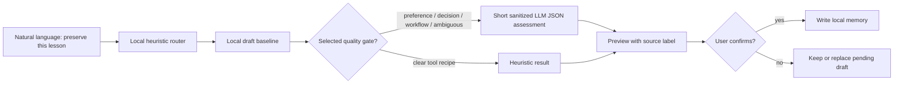

# MemAgent v0.34 Plan: LLM-Assisted Memory Quality Gate

## Goal

Improve the quality of a **draft preview**, not the authority to persist a
memory. MemAgent remains local-first and human-in-the-loop: an LLM can assess
an ambiguous candidate, but only an explicit user confirmation creates a
durable memory card.



## What LLM Helps With

The quality gate is deliberately narrow:

- classify the draft kind when a user preference, decision, or workflow is
  easy to misclassify with keywords;
- assign `keep`, `revise`, or `reject` with a score and short reasons;
- offer a short generalized rewrite as a preview aid.

The original local draft remains the proposed durable content. This preserves
exact private engineering entrypoints locally while ensuring that a remote LLM
never receives them merely to decide draft quality.

## Selection and Privacy

The LLM call happens only when all of the following are true:

1. The user has already requested a memory preview through normal language.
2. The draft is a preference, decision, workflow, or is in an ambiguous
   heuristic score range.
3. An OpenAI-compatible profile is explicitly selected through the command or
   local environment.

Before the request, MemAgent limits the payload to a short candidate,
semantic source summary, and minimal project context. It generalizes absolute
paths, URLs, token-like values, compound identifiers, and long numeric values.
It never sends a full thread, raw request/response bodies, passwords, cookies,
or API keys.

## Fallback and Evidence

Invalid JSON, a missing profile, or a provider failure produces a normal local
heuristic preview with an explicit fallback label. Nothing is auto-saved.

Local pending-draft and process-trace evidence stores only a compact gate
record: provider type, whether a call was attempted, final source, scores,
labels, and fallback reason. It excludes the raw model response, suggested
rewrite, and source excerpt.

## Product Surface

The normal user-level Skill continues to call one command:

```bash
memagent process "<latest user message>"
```

To opt in only for draft quality, keep the router heuristic and configure a
local profile outside any service repository:

```bash
export MEMAGENT_DRAFT_PROVIDER=openai-compatible
export MEMAGENT_DRAFT_LLM_PROFILE=<local-profile-name>
```

Or use the explicit one-off form:

```bash
memagent process "记住这个用户习惯，先给我预览" \
  --recent-text "<short verified lesson>" \
  --draft-provider openai-compatible \
  --draft-llm-profile <local-profile-name>
```

The preview identifies whether the result came from `llm_assisted`,
`heuristic`, `heuristic_skipped`, or `heuristic_fallback`. Provider credentials
are never printed.

## Non-Goals

- No automatic long-term memory writes.
- No full transcript upload, vector database, background daemon, or desktop
  agent.
- No claims that a memory is stale or low quality without evidence.
- No modifications to a business repository, its `AGENTS.md`, or its Git
  working tree.
