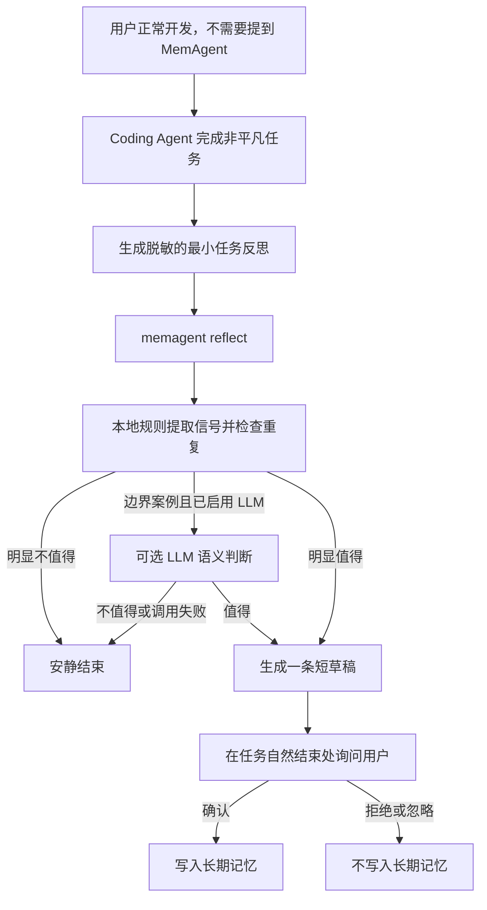

# MemAgent v0.4.0 设计：自动发现记忆候选

## 1. 产品目标

让用户在正常使用 Coding Agent 时，不需要主动想起 MemAgent，也能在一次有价值的排查或开发结束后收到一条简短、可确认的记忆建议。

本版本只自动发现和生成候选，不自动写入长期记忆：

> Coding Agent 在任务边界提交一份最小化反思，MemAgent 判断是否存在高价值经验；有则生成一条待确认草稿，无则安静结束。只有用户明确确认后，草稿才进入长期记忆。

## 2. 当前问题

现有系统已经支持：

- `memagent suggest` 生成 Agent 主动建议的草稿；
- 草稿去重、替换、48 小时过期；
- 用户自然语言确认或拒绝；
- 确认后写入长期记忆；
- activity 展示建议、确认、拒绝和过期。

真正缺失的是自动发现层。现在必须由 Coding Agent 自己先得出“一条值得记忆的 lesson”，再调用 `suggest`。真实使用中，这个动作容易被忽略，导致记忆供给不足。

## 3. 目标体验



建议文案保持自然，例如：

> 刚才确认了一个可复用的排查入口：修改查询前先核对实时 schema，而不是依赖旧文档。要把它记住供下次使用吗？

用户不需要知道 `reflect`、`suggest`、`draft` 或 `remember` 等内部术语。

## 4. 新入口：`memagent reflect`

### 4.1 职责

`reflect` 接收任务结束时的短反思，负责：

1. 判断内容是否具有复用价值；
2. 从证据中提炼最多一条可执行经验；
3. 与已有记忆和当前待确认草稿去重；
4. 决定生成草稿或放弃；
5. 记录轻量决策证据，便于后续评估。

它不负责保存长期记忆，也不读取完整 Codex 会话。

### 4.2 建议的 CLI

```bash
memagent reflect \
  --summary "A short sanitized account of the investigation and outcome." \
  --signal detour \
  --signal verified_outcome
```

可重复的 `--signal` 首期支持：

- `detour`：出现有意义的绕路或重复失败；
- `correction`：用户或实时证据纠正了 Agent；
- `verified_entrypoint`：确认了稳定的命令、接口、schema 或入口；
- `costly_investigation`：较长排查最终得到更短的可复用路径；
- `workflow`：形成稳定的多步骤流程；
- `project_boundary`：确认了稳定的项目约束；
- `verified_outcome`：结论经过代码、测试或工具结果验证。

`--summary` 是事实摘要，不要求 Agent 预先写好最终 memory。长度默认限制在 1,200 字符以内。

### 4.3 输出

输出沿用现有 `ProcessResult` 思路：

- `action=none`：不值得建议，Codex 不向用户展示任何内容；
- `action=draft_memory`：已经生成待确认草稿，Codex 在最终回复末尾用一句自然语言询问；
- `warnings`：可选 LLM 不可用时说明已回退，但不应打断正常开发。

## 5. 候选判断策略

### 5.1 默认本地判断

默认 `heuristic` 模式只在本地工作。判断维度包括：

- **证据强度**：是否有纠正、失败路径或验证结果；
- **可复用性**：是否可能在未来同类任务再次使用；
- **可执行性**：能否表达为“下次先做什么 / 不要做什么”；
- **稳定性**：是长期入口和流程，还是一次性状态；
- **新颖性**：是否已经存在相似记忆或待确认草稿；
- **信息密度**：是否包含具体但安全的上下文，而非泛泛建议。

明显应放弃的内容：

- 普通编译错误、拼写错误和一次性网络失败；
- 未验证的猜测；
- “仔细检查代码”一类通用建议；
- 仅描述完成了什么，没有下次可执行动作；
- 已有记忆的近似重复；
- 仅包含临时需求状态，更适合 handoff 的内容。

### 5.2 可选 LLM 判断

- `heuristic`：完全本地，达到高置信门槛才建议；
- `hybrid`：本地明确接受或拒绝，只有边界案例调用 LLM；
- `llm`：仍先执行隐私过滤、硬性拒绝和去重，再由 LLM 判断语义价值并改写草稿。

LLM 只接收脱敏后的短反思、信号类型、最小项目标识和少量相似记忆摘要。不得发送完整会话、命令输出、原始业务样本或整个记忆库。

调用失败时回退到本地策略。复用现有 gate health 和失败冷却，避免在每个任务结尾重复等待超时。

## 6. 防打扰策略

- 每个 Codex task/session 最多主动展示一条建议；
- 只在任务完成、验证完成、明确阻塞或用户准备结束时触发；
- 不在排查过程中插话；
- 与已有记忆高度相似时直接放弃；
- 同一经验被用户拒绝后进入项目级冷却；
- 已有用户主动要求生成的待确认草稿时，不得覆盖；
- 新的 Agent 建议仍沿用现有替换和 48 小时过期机制；
- 默认只展示一句候选和一个确认问题，不输出评分、provider 或内部路由细节。

## 7. Codex 接入

用户级 Skill 在非平凡任务的最终回复前增加一次任务边界检查：

1. 当前工作是否产生了明确、已验证且可复用的经验；
2. 若可能存在，生成不包含原始敏感数据的短反思；
3. 调用 `memagent reflect`；
4. 仅当返回 `draft_memory` 时，向用户展示一句确认问题；
5. `none` 时正常结束，不提 MemAgent。

### 接入限制

v0.4.0 仍是用户级 Skill，无后台守护进程，也不修改业务仓库。它能让用户无需主动调用 MemAgent，但不能从系统层保证 Codex 每次都执行任务边界反思。

因此必须记录 `reflect` 调用次数，并通过真实使用观察 Skill 遵循率。若调用覆盖率仍然不足，后续再评估更强的 Codex hook、wrapper 或 MCP 生命周期接入；不能用扩大自然语言触发词列表假装解决自动发现问题。

## 8. 本地数据和隐私

新增本地记录仍只写入 `~/.memagent/`：

- `reflection_traces/`：短反思的评分结果、信号和最终动作；
- 现有 `pending_memory_drafts/`：仅保存通过判断的待确认草稿；
- 现有 `memories/`：仅保存用户确认后的长期记忆。

reflection trace 不保存完整会话、原始命令输出、token、cookie、私钥、长 SQL 结果、请求响应体或远程仓库 URL。项目和 session 继续使用本地派生标识。

## 9. 可观测指标

activity 增加：

- `reflections_considered`：收到多少次任务边界反思；
- `suggestions_emitted`：生成多少条建议；
- `suggestions_abstained`：主动放弃多少次；
- `duplicate_suppressed`：因重复被抑制多少次；
- `accepted / rejected / expired`：建议后续结果；
- `acceptance_rate`：用户明确处理过的建议中，确认比例；
- `later_recalled`：确认保存后是否在后续任务再次召回；
- `decision_latency_ms`：本地和可选 LLM 判断耗时；
- `llm_fallback`：LLM 失败降级次数。

不能仅凭“生成更多记忆”判断成功。首要产品指标是：

> 被用户接受并在后续任务真正召回的自动候选数量，同时控制建议打扰率和判断延迟。

## 10. 分阶段实现

### Phase 1：本地闭环

- 新增 `Reflection` 数据结构和 `memagent reflect`；
- 实现本地候选评分、硬性拒绝和已有记忆去重；
- 复用现有 `suggest` 生成待确认草稿；
- 增加 reflection trace 和 activity 指标；
- 更新 Codex Skill，在任务边界调用 reflect；
- 覆盖临时 Git 项目的零侵入端到端测试。

### Phase 2：可选语义增强

- hybrid 边界判断；
- llm 模式的价值判断和草稿改写；
- 脱敏边界、超时、失败冷却和 fallback 测试；
- 比较 heuristic 与 hybrid 的建议接受率和延迟。

### Phase 3：真实使用验证

- 在日常 Coding Agent 使用中积累至少一周数据；
- 检查是否仍大量漏掉明显踩坑；
- 人工抽查建议是否具体、稳定、可执行；
- 根据真实反馈调整阈值，而不是为了提高数量降低门槛；
- 决定是否需要比用户级 Skill 更强的生命周期接入。

## 11. v0.4.0 验收标准

- 用户不提 MemAgent，Codex 在一次存在明确踩坑并完成验证的任务后可以主动给出一条候选；
- 普通小改动和一次性错误不产生建议；
- 一次任务最多展示一条建议，重复内容不展示；
- 候选未经用户确认不会写入长期记忆；
- 无 API Key 时完整流程可用；
- LLM 缺失、超时或限流时快速回退，不拖慢最终回复；
- activity 能复盘反思、建议、接受、拒绝、过期和后续召回；
- 不修改业务仓库、业务 `AGENTS.md` 或 Git 工作区；
- 全量测试、compileall、构建和 pipx smoke test 通过。

## 12. 非目标

- 静默自动写入长期记忆；
- 上传或长期保存完整 Codex 会话；
- 后台守护进程或桌面常驻 Agent；
- 用向量数据库掩盖记忆供给和质量问题；
- 为了提高记忆数量而记录所有错误；
- 在没有真实用户标签时声称召回或候选准确率已经提升。
