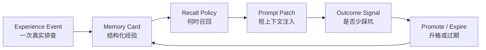
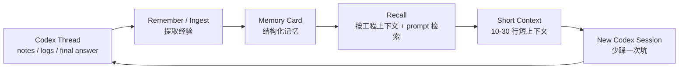
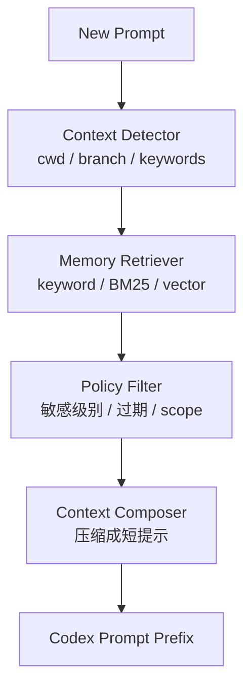
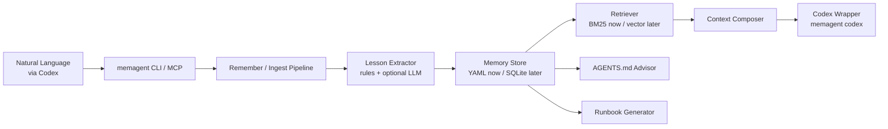
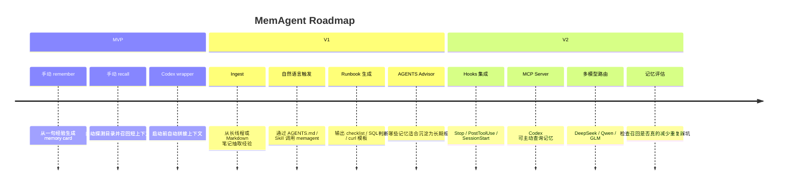

# MemAgent 跨会话工程工作流记忆产品方案

## 1. 项目定位

项目暂定名：**MemAgent**

一句话定位：

> 辅助 Codex 等 coding agent，把线程里的成功经验、失败路径、工具命令和排查结论，沉淀成下一次会话可召回的结构化 workflow memory。

它不是 OpenClaw、Hermes 这类通用 agent 平台，也不是替代 Codex 或 `AGENTS.md`。它只做一件事：作为 coding agent 的跨会话工作流记忆层，让 Codex 在新线程里少重复踩坑。

面试时可以把它讲成一个外置于 coding agent 的 **memory substrate**：它不负责写代码主流程，而是负责把长线程里已经验证过的工程经验变成可观测、可编辑、可召回、可评估的上下文资产。

## 2. 开发目录建议

建议代码放在：

```text
/Users/bytedance/Desktop/work/personal_agents/memagent
```

原因：

- 不放在 `/Users/bytedance/Desktop/work/attribution`，避免和字节业务仓库混在一起。
- 后续可以独立建 Git 仓库、写 README、做开源或简历展示。
- 产品方案、设计笔记和代码都优先放在 MemAgent 项目内，必要时再把阶段复盘同步到个人材料目录。
- 项目代码和公开 demo 用 mock 数据和脱敏样例；本机私有 memory 可以保留必要工程入口，但不提交到仓库。

本地私有记忆建议放在：

```text
~/.memagent/
```

目录结构：

```text
~/.memagent/
  memories/
    *.memory.yaml
  indexes/
    vector.sqlite
  logs/
    ingest.log
  config.toml
```

## 3. 核心痛点

最近使用 Codex 的真实痛点：

- 一个线程里跑通了 `bytedcli`、RDS、BAM、curl、PPE 验证，换个会话又要重新找。
- 有些坑已经踩过，比如大表 JSON 统计超时、库名搜索路径、接口 header、状态字段口径，但新线程没有自动继承。
- `AGENTS.md` 能放长期稳定规则，但不适合放大量动态、具体、可能敏感的排查经验。
- `todolist`、runbook、SQL、curl、结论分散在不同文档和线程里，下一次恢复成本高。

## 4. 产品边界

适合放进 `AGENTS.md`：

- 仓库规范
- 常用验证命令
- 工作目录规则
- 不要做什么
- 长期稳定的工程约束

适合放进 Memory Agent：

- 某类问题的排查顺序
- 上次哪个命令失败、为什么失败
- 正确的库/表/API/参数入口
- 工具调用 recipe
- 新会话恢复提示
- 是否建议更新 `AGENTS.md`

## 5. 与 AGENTS.md / Codex Memories 的区别

MemAgent 的定位不是重复 Codex 现有能力，而是补一个更显式、更工程化的 workflow memory layer。

一句话区分：

> `AGENTS.md` 管稳定规则，Codex Memories 管宿主侧偏好和历史摘要，MemAgent 管可复用的工程工作流经验。

| 能力 | 适合保存什么 | 局限 | MemAgent 的差异 |
|---|---|---|---|
| `AGENTS.md` | 稳定仓库规则、长期约束、验证命令、代码风格 | 不适合频繁变化的排查经验；内容过多会污染所有任务上下文 | MemAgent 保存动态经验，只在相关任务召回，并可建议哪些经验升格到 `AGENTS.md` |
| Codex Memories / `MEMORY.md` 类机制 | 用户偏好、常见工作流、历史上下文摘要 | 更偏宿主侧记忆，召回和使用方式不一定透明；不适合手动维护精确工具 recipe 和失败路径 | MemAgent 用显式 memory card 保存可编辑、可检索、可评估的工程记忆 |
| runbook / todolist | 人写的操作步骤、临时排查记录 | 分散、不会自动按当前目录和任务召回，也缺少过期和升格机制 | MemAgent 把这些材料结构化为 scope、trigger、pitfall、recipe、next action |
| 普通 RAG | 文档片段检索 | 只解决“找到相关文本”，不理解经验生命周期 | MemAgent 面向 coding workflow，记录成功路径、失败路径、适用范围、下次动作和验证方式 |

MemAgent 要重点解决的是：

- **显式可控**：用户可以明确说“沉淀一下”，也可以查看和编辑 memory card。
- **工具 recipe 保真**：本地私有记忆可以保留必要的 `bytedcli` 命令、库名、表名、API path、header、env 等工程入口。
- **上下文短注入**：召回结果会被压缩成 10-30 行，避免把历史长线程塞进新会话。
- **召回可解释**：召回时可以显示 memory 来源、简单分数和命中词，避免变成黑盒记忆。
- **上下文可打包**：召回结果会经过 context packer，去重重复建议，控制短上下文预算，并标记是否截断。
- **集成可安装**：通过 `agents-install` 以 dry-run-first 的方式把 MemAgent 触发规则写入 `AGENTS.md`。
- **集成可检查**：通过 `agents-doctor` 检查当前项目 AGENTS.md 是否已具备 recall/remember 触发能力。
- **演示可复现**：通过 `demo-run` 在隔离目录里生成 mock 项目和 transcript，稳定展示 install、doctor、recall、prompt patch。
- **协议可扩展**：通过 `mcp-stdio` 把 recall、remember、doctor 暴露成 MCP tools，服务未来 Cursor、Claude Code 等 MCP client。
- **召回可评估**：通过 `recall-eval` 用 mock benchmark 对比 BM25 和 keyword baseline，输出 hit@1 / MRR 报告。
- **交接可延续**：通过 `handoff save/show` 保存每个项目最近一次交接状态，让新会话可以先 catch up，再决定是否召回长期 memory。
- **交接可草稿化**：通过 `handoff draft --from-file` 从线程笔记或 transcript 生成可审阅 handoff draft，用户确认后再 `--save`。
- **候选可升格**：通过 `handoff promote` 把 handoff 里的 `Memory Candidates` 预览并显式写入长期 memory card。
- **经验生命周期**：区分一次性上下文、可复用 workflow、可升格 `AGENTS.md` 的稳定规则。
- **跨 coding agent**：当前主攻 Codex，但 memory card 设计不绑定 Codex，未来可以服务 Cursor、Claude Code 等 coding agent。

对标调研见 [competitive-scan.md](competitive-scan.md)，v0.10 定位校准见 [design_v0.10_competitive_positioning.md](design_v0.10_competitive_positioning.md)。当前差异化重点不是“也做长期记忆”，而是 Codex-first 的 workflow memory lifecycle：围绕真实工程线程里的工具 recipe、失败路径、数据入口和验证方式做记录、召回、注入、评估和升格。

## 6. 可面试的系统内核

MemAgent 不把“记忆”看成一段普通文本，而是一个可以被抽取、召回、注入、验证和升格的工程对象。



核心设计对象：

- **Experience Event**：一次 Codex 线程里的成功命令、失败命令、结论、验证口径。
- **Memory Card**：把经验拆成 scope、trigger、tool recipe、pitfall、next action、validation、sensitivity。
- **Recall Policy**：结合当前目录、git root、分支、用户 prompt、最近修改文件判断是否相关。
- **Prompt Patch**：把召回结果压成短上下文，只给 Codex 下一步最该知道的内容。
- **Lifecycle Signal**：记录记忆是否被命中、是否有效、是否应该升格到 `AGENTS.md` 或过期。

这也是它比“普通 RAG”更可讲的地方：RAG 的核心是检索文本，MemAgent 的核心是管理 coding workflow memory 的生命周期。

## 7. MVP 闭环

第一版先做底层能力。命令行是能力内核，不是最终交互形态。

```bash
memagent remember "这次 RDS 大表统计不要直接 JSON group，先按 id 分段。"
memagent recall "我要查机审归因准确率"
memagent codex "我要查机审归因准确率"
```

其中 `cwd`、git root、分支等工程上下文由 memagent 自动探测，用户不需要每次传 `--cwd .`。`ingest ./thread.md` 放在下一步，用来从长线程或 Markdown 笔记里半自动抽取 memory card。

### 闭环图



## 8. 触发方式设计

### 8.1 第一阶段：CLI 手动触发

第一阶段先实现命令行能力：

```bash
memagent remember "这次 RDS 大表统计不要直接 JSON group，先按 id 分段。"
memagent recall "继续查机审归因准确率"
memagent codex "继续查机审归因准确率"
```

优点：

- 不吵。
- 不会乱写记忆。
- 适合产品验证。
- 当前版本已经落地 `remember`、`recall`、`codex` 三个最小闭环命令。

### 8.2 第二阶段：Codex 自然语言触发

用户最终不应该记命令，而是在 Codex 里自然表达：

```text
记住这个
沉淀一下
下次别再踩这个坑
把这次排查做成 memory
先看看之前有没有相关经验
召回一下相关记忆
```

触发方式：

```text
用户自然语言
  -> Codex 根据 AGENTS.md / Skill 规则识别意图
  -> Codex 调用 memagent CLI 或 MCP 工具
  -> memagent 写入或召回本地记忆
```

这时 `AGENTS.md` 不是存储 memory 的地方，而是告诉 Codex：“当用户说这些话时，应该调用 memagent”。

### 8.3 第三阶段：半自动提示

检测到以下模式时，提示用户是否沉淀：

- 连续失败命令后出现成功命令。
- final answer 中出现“正确口径”“下次建议”“不要再”。
- 文件里出现 `todolist.md`、`runbook.md`、`SQL`、`curl`。
- 命令中出现 `bytedcli`、`rds`、`bam`、`curl`、`pytest`、`go test`。

### 8.4 第四阶段：Codex Hooks / MCP / Plugin 集成

可接 Codex Hooks：

- `Stop`：每轮结束后检查是否有值得沉淀的结论。
- `PostToolUse`：记录关键工具调用轨迹。
- `PreCompact`：长线程压缩前生成 memory draft。
- `SessionStart`：新会话启动时召回相关记忆。

## 9. 新会话召回机制

召回输入不是让用户挨个填写，而是 memagent 在后台自动探测：

```text
cwd：当前命令所在目录，自动读取
git root：自动读取
branch：自动读取
用户 prompt：用户自然语言任务
最近修改文件：自动从 git status / diff 读取
已有 AGENTS.md 摘要：自动从当前目录向上查找
```

主路径应是：

```bash
memagent recall "帮我查机审归因准确率"
memagent codex "帮我查机审归因准确率"
```

`--cwd` 只作为高级调试参数保留，不放进主流程。

召回输出：

```text
[MemAgent recalled context]
- 当前目录像质量归因统计任务。
- 历史经验：准确率不要混用全链路结果标签和专项人工标签。
- 优先查专项任务表中的人工提交标签。
- 大表统计先 LIMIT 或按 id 分段，避免 JSON 全表 group。
- 如需写入长期规范，再建议更新 AGENTS.md。
```

### 召回图



## 10. Memory Card 格式

```yaml
id: mem_20260622_001
scope:
  repo: demo_repo
  module: quality_attribution
topic: 质量归因准确率统计
triggers:
  - 归因准确率
  - missing_log_analysis
  - quality_attribution_task
stable_facts:
  - 统计人工回收准确率时，应优先使用专项任务表的人工作业标签。
tool_recipes:
  - name: 查询任务状态分布
    command_template: "bytedcli rds db query <db> \"<sql>\""
pitfalls:
  - 不要把全链路结果标签和专项人工标签混算。
  - 大表 JSON group 容易超时，优先按主键范围分段。
next_time_prompt:
  - 先确认人工提交样本数，再计算一级/二级/三级准确率。
validation:
  - 用小样本 SQL 先核对分母，再跑分段统计。
agents_md_suggestion:
  - 统计口径如果长期稳定，可写入服务局部 AGENTS.md。
sensitivity:
  level: internal
  exportable: false
status:
  maturity: draft
  promotion_candidate: false
created_at: "2026-06-22"
```

## 11. 技术架构



推荐技术栈：

- CLI：MVP 用 Python 标准库 `argparse` 保持零依赖，后续可换 Typer 提升交互体验。
- 存储：当前 YAML memory cards，后续加 SQLite 保存索引、命中日志和评估信号。
- 检索：当前 BM25-style scoring，后续补向量召回和 rerank。
- 模型：DeepSeek/Qwen 作为默认便宜模型，GLM 作为复杂分析 fallback。
- Codex 集成：先 CLI wrapper，后 AGENTS.md/Skill 自然语言触发，再 Hooks/MCP/Plugin

LLM 的应用点不放在“存储记忆”本身，而放在更有价值的几个环节：

- **Extraction**：从长线程中抽取成功路径、失败路径、工具 recipe、适用范围。
- **Compression**：把多条记忆压缩成 10-30 行短上下文。
- **Conflict Detection**：发现两条 memory 对同一任务给出相反建议。
- **AGENTS Advisor**：判断某条动态经验是否稳定到可以升格为 `AGENTS.md` 规则。
- **Safety Rewriter**：生成公开 demo 或简历材料时，把内部细节替换成可展示样例。

## 12. MVP 功能列表

当前第一版已经落地：

- `memagent remember` 从手动文本保存 memory card。
- 自动探测当前目录、git root、分支，再结合用户 prompt 检索相关记忆。
- 生成 10-30 行短上下文。
- 支持 `memagent codex` 包一层启动 Codex。
- 保留 `memagent recall` 供调试和预览。

下一步补强：

- `memagent ingest ./thread.md` 读取 Markdown 线程或手动笔记。
- 抽取成功经验、失败路径、关键命令、下一次提示。
- 记录 memory 命中日志，用于评估召回是否真的有用。
- 让 AGENTS.md 自然语言触发从“规则约定”变成可安装片段或 skill。

暂不做：

- 自动读取所有 Codex 私有线程。
- 自动写入 `AGENTS.md`。
- 自动发送内部数据到云端。
- 桌面 UI。
- 多人协作同步。
- 做成通用 coding agent 平台。

## 13. 安全边界

必须做到：

- 默认本地存储。
- memory card 标记敏感级别。
- 本地私有 memory 优先保留可复用工程入口，例如必要的命令、库名、表名、API path、header、env。
- 不保存 token、cookie、密码、私钥、原始敏感业务样本、大段查询结果或大段请求/响应体。
- 公开导出、demo、简历展示前必须生成脱敏版本。
- 不把公司真实库名、表名、接口、ID、飞书链接放进公开 demo 数据。
- `AGENTS.md` 更新只生成建议，不自动写。

## 14. 后续路线



## 15. 面试叙事与技术亮点

面试时不要把 MemAgent 讲成“做了一个 RAG”。更好的表达是：

> 我做的是 coding agent 的跨会话 workflow memory layer。它把长线程中的成功路径、失败路径、工具 recipe 和适用范围抽取成结构化 memory card，并在新会话中基于工程上下文召回和压缩，减少重复排查。

可讲的技术点：

- **Memory Extraction**：从长对话、命令轨迹和 final answer 中抽取可复用经验，而不是简单摘要。
- **Schema of Memory**：用结构化 memory card 表示 topic、trigger、scope、pitfall、tool recipe、next action、validation、sensitivity。
- **Context-aware Recall**：结合 cwd、git root、branch、prompt、最近修改文件、AGENTS.md 摘要做召回。
- **Context Composition**：把多条记忆融合成短提示，控制注入上下文长度，去重重复建议，并显式展示 pack budget / truncation。
- **Lifecycle Management**：区分动态 memory 和稳定规则，未来支持过期、冲突检测、召回效果评估、AGENTS.md 升格建议。
- **MCP Protocol Surface**：通过 MCP tools 暴露 recall/remember/handoff，并用 tool annotations 区分只读、写入、幂等和外部访问风险。
- **Local-first Safety**：私有本地记忆可保留精确工程入口；公开导出时再脱敏。

面试中可以主动讲三个边界问题：

- **为什么不是 `AGENTS.md`**：`AGENTS.md` 是稳定指令面，MemAgent 是动态经验面；前者适合全局约束，后者适合按任务召回。
- **为什么不是 Codex Memories**：宿主 memories 偏隐式和摘要化，MemAgent 追求显式 memory card、精确工具 recipe、可编辑、可评估。
- **为什么不是普通 RAG**：普通 RAG 召回文本，MemAgent 召回“下一次应该怎么做”和“上次为什么错”。

可以量化的指标：

- **Time to Context**：新会话恢复到关键上下文的时间。
- **Repeated Failure Avoided**：是否减少重复错误命令、错误 SQL、错误接口入口。
- **Recall Precision**：召回的 memory 是否真正相关。
- **Context Pollution**：注入上下文是否足够短，是否干扰 Codex 主任务。
- **Promotion Rate**：多少动态 memory 最终被证明稳定，可升格为 `AGENTS.md`。

可压缩成简历 bullet：

> 设计并实现面向 Codex 的跨会话工作流记忆系统，支持从 coding-agent 会话中抽取成功路径、失败命令、工具 recipe 和适用范围，基于项目上下文进行记忆召回与短上下文压缩，并通过本地私有 memory card 管理动态工程经验，降低跨线程重复排查成本。

## 16. 成功标准

MVP 成功不是功能多，而是能证明：

- 新会话不用重新找一次库。
- 新会话少跑一次错误 SQL。
- 旧线程的关键结论能被 30 秒恢复。
- 记忆能区分“长期规则”和“一次性经验”。
- 生成的短上下文足够短，不污染 Codex 主任务。

第一阶段目标：

> 选 3 个你真实踩过的例子，做成 memory card。下一次新会话中，能自动召回并减少重复排查。
