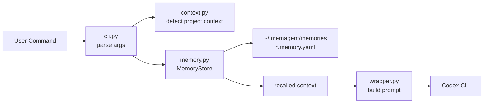
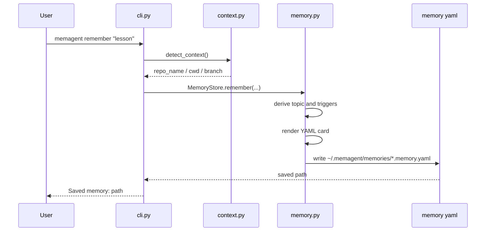
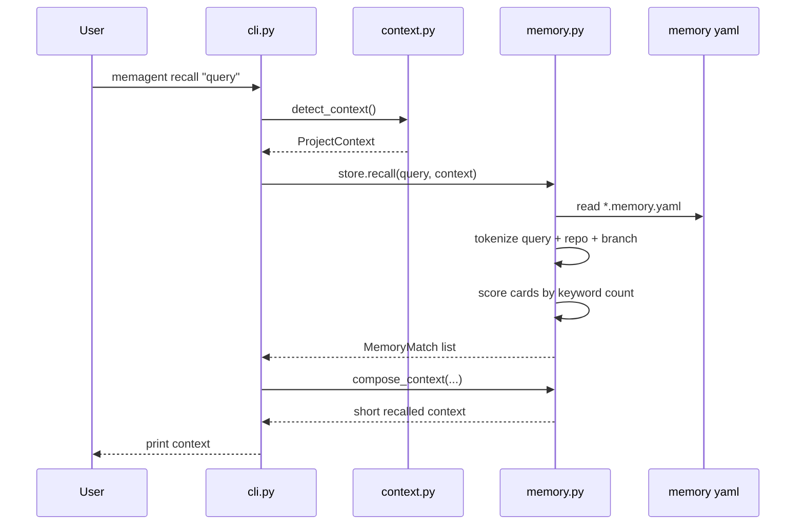
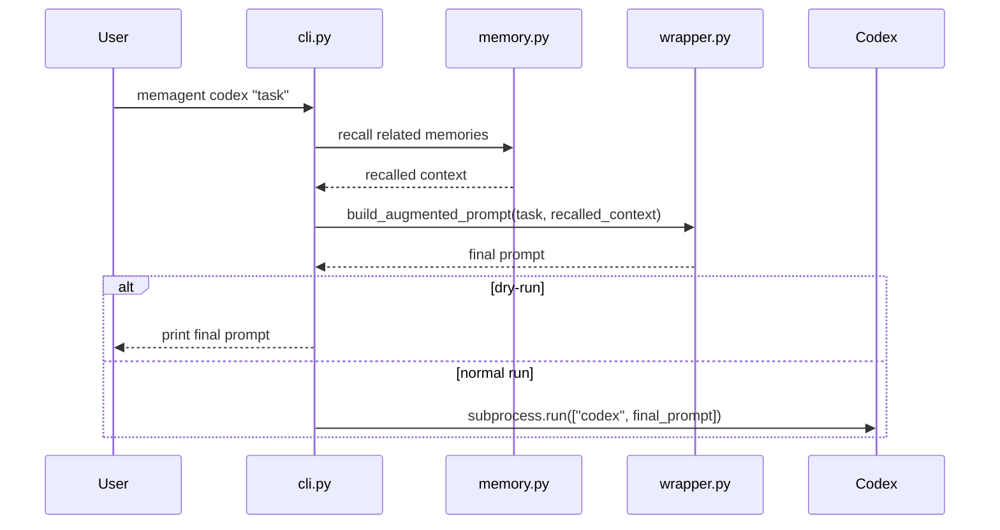

# MemAgent 技术讲解文档

这份文档用来解释当前代码结构。后续每加一个功能，都应该同步更新这里，保证项目不是“功能堆上去了，但自己看不懂”。

当前版本的 MemAgent 还很小，可以先理解成四个模块：

```text
src/memagent/
  cli.py       命令行入口，负责把用户命令转成函数调用
  context.py   探测当前工程上下文，比如 cwd、git root、branch、AGENTS.md
  memory.py    记忆存储与召回，负责写 memory card、检索、生成短上下文
  wrapper.py   把召回上下文拼到 Codex prompt 前
```

## 1. 当前运行方式

开发阶段还没要求必须安装包，所以主要用：

```bash
PYTHONPATH=src python -m memagent.cli remember "这次 RDS 大表统计不要直接 JSON group，先按 id 分段。"
PYTHONPATH=src python -m memagent.cli recall "继续查归因准确率"
PYTHONPATH=src python -m memagent.cli codex --dry-run "继续查归因准确率"
```

安装成 editable package 后，才可以直接用：

```bash
python -m pip install -e .
memagent remember "..."
memagent recall "..."
memagent codex "..."
```

默认记忆文件写到：

```text
~/.memagent/memories/
```

也可以通过 `MEMAGENT_HOME` 或 `--home` 换成测试目录。

## 2. 一句话理解架构

MemAgent 当前做的是：

> 把一句经验写成本地 YAML memory card；下一次根据当前目录和用户 prompt 找到相关 card；再把结果压成短上下文拼给 Codex。

整体流程：



## 3. 三条命令分别做什么

### 3.1 `remember`

用途：把用户手动输入的一条经验写成本地 memory card。

命令：

```bash
memagent remember "RDS JSON aggregation timed out; split by id ranges before grouping."
```

执行链路：



关键代码位置：

- `cli.py`：解析 `remember` 的参数，调用 `detect_context()` 和 `store.remember(...)`。
- `context.py`：自动推断当前 repo 名，作为默认 `repo` scope。
- `memory.py`：生成 ID、topic、triggers，然后调用 `_render_memory_card(...)` 写文件。

当前版本的 `remember` 还比较朴素：它不会真正理解长线程，只是把用户输入的文本保存为 `pitfalls` 和 `source_note`。这正好是后续 `ingest` 和 LLM extraction 要补强的地方。

### 3.2 `recall`

用途：根据用户当前任务，召回相关 memory card，并输出短上下文。

命令：

```bash
memagent recall "how to avoid RDS JSON timeout"
```

执行链路：



当前召回算法很简单：

- 把 `query + repo_name + branch` 分词。
- 扫描 `~/.memagent/memories/*.memory.yaml`。
- 用关键词出现次数打分。
- 如果 memory card 里包含当前 repo 名，额外加分。
- 取分数最高的前几条。
- 从 `stable_facts`、`pitfalls`、`next_time_prompt` 里抽几行，组成短上下文。

这不是最终算法，只是 MVP 的可解释 baseline。后续可以替换成 BM25、向量召回、rerank，但接口上可以继续保持 `store.recall(...)`。

### 3.3 `codex`

用途：把 `recall` 的短上下文自动拼到 Codex prompt 前，然后启动 Codex。

命令：

```bash
memagent codex --dry-run "continue debugging attribution accuracy"
```

执行链路：



设计上有一个小细节：

- 如果没有匹配到 memory，`codex` 不会强行加一段 “No related memories found”。
- 这样不会污染 Codex 的 prompt。
- 但 `recall` 命令会打印 “No related memories found”，因为它是调试命令，用户需要知道结果。

## 4. 文件级讲解

### 4.1 `cli.py`

`cli.py` 是命令行入口，可以把它理解成路由层。

它主要做三件事：

- 定义命令和参数：`build_parser()`。
- 根据 `args.command` 分发到 `remember`、`recall`、`codex`。
- 把底层模块串起来，但不自己做复杂业务逻辑。

核心结构：

```text
build_parser()
  -> 定义全局 --home
  -> 定义 remember 子命令
  -> 定义 recall 子命令
  -> 定义 codex 子命令

main(argv)
  -> parse args
  -> MemoryStore.from_home_arg(args.home)
  -> if remember: detect_context + store.remember
  -> if recall: detect_context + store.recall + compose_context
  -> if codex: recall + build_augmented_prompt + subprocess.run
```

这里有一个小工具函数：

```python
def normalize_remainder(items: list[str]) -> list[str]:
    if items and items[0] == "--":
        return items[1:]
    return items
```

它是为了支持：

```bash
memagent codex "task" -- --model gpt-5.4
```

`argparse.REMAINDER` 会把 `--` 也收进列表里，所以这里手动去掉第一个 `--`。

### 4.2 `context.py`

`context.py` 负责回答一个问题：

> 当前用户在哪个工程里？这个工程有什么上下文可以帮助召回 memory？

核心数据结构是：

```python
@dataclass(frozen=True)
class ProjectContext:
    cwd: Path
    git_root: Path | None
    branch: str | None
    repo_name: str | None
    recent_files: tuple[str, ...]
    agents_files: tuple[Path, ...]
```

字段含义：

- `cwd`：当前执行命令的目录。
- `git_root`：最近的 Git 仓库根目录。
- `branch`：当前分支。
- `repo_name`：用于匹配 memory scope 的项目名。
- `recent_files`：当前 git diff 或 status 里最近改动的文件。
- `agents_files`：从当前目录向上找到的 `AGENTS.md` 或 `AGENTS.override.md`。

主入口：

```python
def detect_context(cwd: Path | None = None) -> ProjectContext:
```

它内部依次做：

- `_git_root(current)`：用 `git rev-parse --show-toplevel` 找仓库根。
- `_git_branch(current)`：用 `git branch --show-current` 找分支。
- `_recent_files(current)`：优先看 `git diff --name-only`，没有 diff 再看 `git status --short`。
- `_find_agents_files(current, git_root)`：从当前目录向上找 AGENTS 文件。
- `_project_name(current, git_root)`：根据 `pyproject.toml`、`package.json`、`go.mod` 等 marker 判断项目名。

当前 `recent_files` 和 `agents_files` 已经探测出来了，但召回算法还没有真正使用它们。这是后续增强 recall policy 的预留点。

### 4.3 `memory.py`

`memory.py` 是当前最核心的文件，负责 memory card 的写入、读取、匹配、渲染。

有两个简单的数据结构：

```python
@dataclass(frozen=True)
class SavedMemory:
    path: Path
    identifier: str
```

表示刚刚保存的 memory。

```python
@dataclass(frozen=True)
class MemoryMatch:
    path: Path
    score: int
    title: str
    lines: tuple[str, ...]
```

表示一次召回命中的 memory。

核心类是：

```python
class MemoryStore:
```

它目前有三个主要方法：

```text
remember(...)         写 memory card
recall(...)           检索 memory card
compose_context(...)  把召回结果压成 prompt 片段
```

#### `MemoryStore.__init__`

```python
def __init__(self, home: Path) -> None:
    self.home = home.expanduser().resolve()
    self.memories_dir = self.home / "memories"
    self.memories_dir.mkdir(parents=True, exist_ok=True)
```

它保证 memory 目录一定存在。比如默认就是：

```text
~/.memagent/memories/
```

#### `MemoryStore.from_home_arg`

优先级是：

```text
命令行 --home > 环境变量 MEMAGENT_HOME > 默认 ~/.memagent
```

这让测试和日常使用可以隔离。

#### `MemoryStore.remember`

负责把一段文本写成 memory card。

当前逻辑：

- 用当前 UTC 时间生成唯一 ID。
- 如果用户没传 `--topic`，用 `_derive_topic(text)` 从文本前 60 个字符生成标题。
- 如果用户没传 `--trigger`，用 `_derive_triggers(text)` 从文本里提取关键词。
- 用 `_render_memory_card(...)` 生成 YAML 字符串。
- 写到 `memories_dir / f"{identifier}.memory.yaml"`。

当前生成的 card 大概长这样：

```yaml
id: "mem_..."
created_at: "..."
topic: "RDS query pitfall"
scope:
  repo: "demo_repo"
  module: "unknown"
triggers:
  - "RDS"
stable_facts:
  - Review the original note before turning this into a durable AGENTS.md rule.
tool_recipes: []
pitfalls:
  - "RDS JSON aggregation timed out..."
next_time_prompt:
  - "Before continuing, recall this lesson: ..."
sensitivity:
  level: internal
  exportable: false
source_note: |
  原始文本
```

#### `MemoryStore.recall`

负责扫描本地 memory card 并打分。

当前召回逻辑：

```text
terms = tokenize(query + repo_name + branch)
for each memory card:
  raw = read yaml text
  score = sum(each term count in raw)
  if current repo_name appears in raw:
    score += 3
  if score > 0:
    create MemoryMatch
sort by score desc
return top limit
```

这里没有真正解析 YAML，是为了 MVP 保持简单。但这也意味着：

- 它容易受文本格式影响。
- 无法做字段级权重。
- 后续应该换成结构化解析和索引。

#### `MemoryStore.compose_context`

负责把多个 `MemoryMatch` 变成短上下文。

输出格式类似：

```text
[MemAgent recalled context]
- Task: how to avoid RDS JSON timeout
- Context: cwd: /path; repo: memagent; branch: main
- Memory: RDS query pitfall
  - RDS JSON aggregation timed out; split by id ranges before grouping.
  - Before continuing, recall this lesson: ...
```

`max_lines` 控制输出行数，避免把太多历史内容塞给 Codex。

### 4.4 `wrapper.py`

`wrapper.py` 现在只有一个函数：

```python
def build_augmented_prompt(user_prompt: str, recalled_context: str) -> str:
```

逻辑很简单：

- 如果 `recalled_context` 是空白，直接返回原始 prompt。
- 否则拼成：

```text
[MemAgent recalled context]
...

[User task]
用户原始任务
```

这个文件单独存在，是为了把“如何拼 prompt”从 CLI 中拆出来。后续如果要支持不同 coding agent，比如 Codex、Claude Code、Cursor，可以在这里扩展不同的 prompt composer。

## 5. 测试怎么读

当前测试很少，主要验证最小闭环。

```text
tests/test_memory_store.py
  test_remember_and_recall

tests/test_wrapper.py
  test_build_augmented_prompt
  test_build_augmented_prompt_without_memory
  test_build_augmented_prompt_ignores_blank_memory
  test_normalize_remainder
```

`test_memory_store.py` 做的是：

- 创建临时目录作为 memory home。
- 调用 `store.remember(...)` 写一条 memory。
- 构造一个假的 `ProjectContext`。
- 调用 `store.recall(...)` 找回 memory。
- 调用 `compose_context(...)` 确认输出里有标题和关键句。

这说明当前测试关注的是“能写、能召回、能渲染”，不是复杂召回质量。

运行测试：

```bash
PYTHONPATH=src python -m compileall src tests
PYTHONPATH=src python -m unittest discover -s tests
```

## 6. 当前代码的三个明显阶段

### 阶段一：已完成的最小闭环

- 手动 `remember`。
- 本地 YAML 存储。
- keyword 召回。
- `recall` 预览短上下文。
- `codex --dry-run` 查看最终 prompt。

### 阶段二：下一步最自然的增强

- `ingest`：从 Markdown 线程或总结中抽取 memory card。
- 结构化 YAML 解析：不再只扫 raw text。
- 更细的 memory schema：把 tool recipe、pitfall、validation 真正拆开。
- 命中日志：记录某条 memory 是否被召回、是否有用。

### 阶段三：更像 Agent 项目的能力

- LLM extraction：自动从长线程抽取成功路径和失败路径。
- LLM compression：把多条 memory 压成更自然的短上下文。
- conflict detection：同一任务召回了互相冲突的经验时给出提醒。
- AGENTS Advisor：判断某条 memory 是否应该升格成稳定规则。
- MCP / Skill / Hook：让 Codex 更自然地调用 MemAgent。

## 7. 建议阅读顺序

如果你现在看代码会懵，建议不要从 `memory.py` 细节开始硬啃。按这个顺序会舒服很多：

1. 先读 `README.md`，知道命令长什么样。
2. 再读 `cli.py` 的 `main()`，看三条命令怎么分发。
3. 只看 `memory.py` 里的 `MemoryStore.remember()`，理解“怎么写 memory”。
4. 再看 `MemoryStore.recall()`，理解“怎么找 memory”。
5. 看 `compose_context()` 和 `wrapper.py`，理解“怎么喂给 Codex”。
6. 最后看 `context.py`，理解 repo、branch、AGENTS.md 是怎么自动探测的。
7. 看测试，确认自己能讲出每个测试在保护什么行为。

## 8. 之后每次开发前先问的几个问题

为了不把项目推得太快，每次准备加功能前可以先回答：

- 这个功能属于 `context`、`memory`、`wrapper`、`cli` 里的哪一层？
- 它会不会改变 memory card schema？
- 它是否需要测试一个新的用户路径？
- 它是 MVP 必需，还是为了简历叙事好看？
- 它会不会让用户更难理解当前代码？

只要这些问题能答清楚，再写代码会更踏实。

