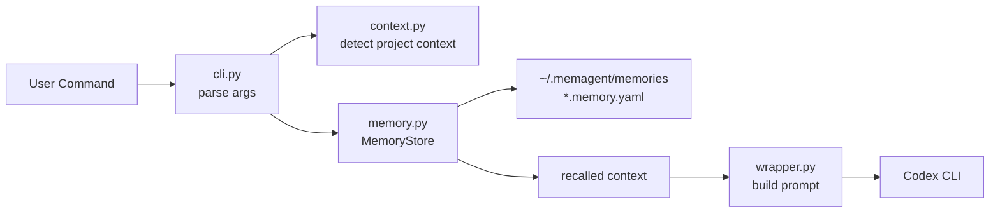
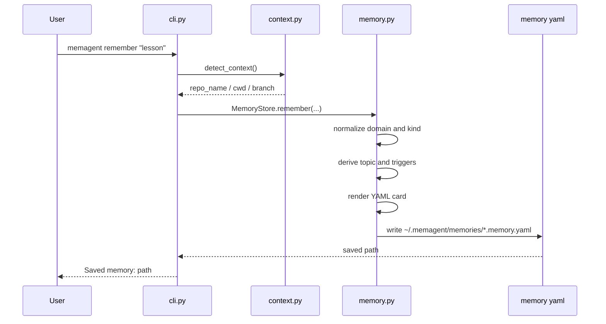
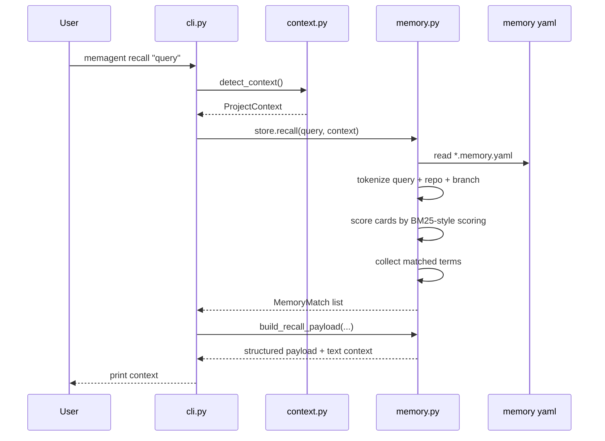
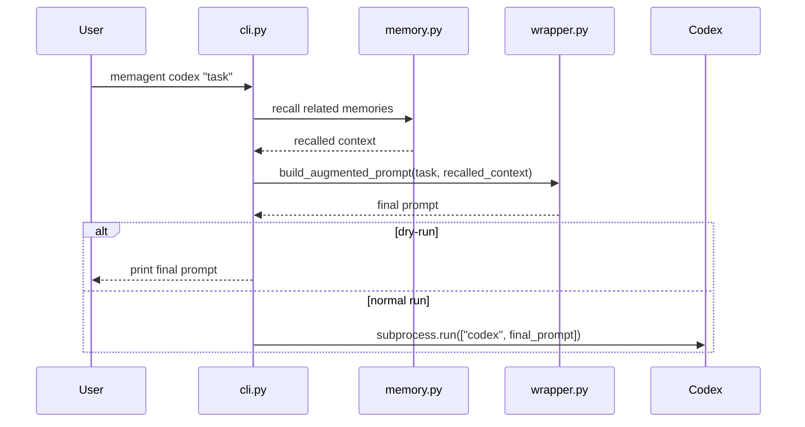

# MemAgent 技术讲解文档

这份文档用来解释当前代码结构。后续每加一个功能，都应该同步更新这里，保证项目不是“功能堆上去了，但自己看不懂”。

当前版本的 MemAgent 还很小，可以先理解成几个核心模块：

```text
src/memagent/
  agents.py    生成 AGENTS.md 触发规则，并检查 AGENTS.md 集成状态
  cli.py       命令行入口，负责把用户命令转成函数调用
  context.py   探测当前工程上下文，比如 cwd、git root、branch、AGENTS.md
  demo.py      运行隔离 demo，并生成可分享的 Markdown transcript
  eval.py      运行 mock recall benchmark；也从真实 trace feedback 生成 eval report
  handoff.py   生成 handoff draft，并保存/读取每个项目最近一次 catch-up 状态
  memory.py    记忆存储与召回，负责写 memory card、检索、生成短上下文
  mcp.py       最小 MCP stdio server，把 recall/remember/handoff/trace/doctor 暴露为 tools
  wrapper.py   把召回上下文拼到 Codex prompt 前
```

## 1. 当前运行方式

开发阶段还没要求必须安装包，所以主要用：

```bash
PYTHONPATH=src python -m memagent.cli remember --domain coding --kind pitfall "这次 RDS 大表统计不要直接 JSON group，先按 id 分段。"
PYTHONPATH=src python -m memagent.cli recall "继续查归因准确率" --show-sources --show-reasons --strategy bm25
PYTHONPATH=src python -m memagent.cli recall "继续查归因准确率" --json
PYTHONPATH=src python -m memagent.cli recall "继续查归因准确率" --trace
PYTHONPATH=src python -m memagent.cli trace list
PYTHONPATH=src python -m memagent.cli trace label --rating useful
PYTHONPATH=src python -m memagent.cli trace report
PYTHONPATH=src python -m memagent.cli trace eval
PYTHONPATH=src python -m memagent.cli codex --dry-run "继续查归因准确率"
PYTHONPATH=src python -m memagent.cli agents-snippet
PYTHONPATH=src python -m memagent.cli agents-install
PYTHONPATH=src python -m memagent.cli agents-doctor
PYTHONPATH=src python -m memagent.cli handoff show
PYTHONPATH=src python -m memagent.cli handoff draft --from-file local_memory_demo/demo_run/session_notes.md
PYTHONPATH=src python -m memagent.cli handoff promote --index 1
PYTHONPATH=src python -m memagent.cli demo-run --reset
PYTHONPATH=src python -m memagent.cli demo-bundle --reset
PYTHONPATH=src python -m memagent.cli mcp-stdio
PYTHONPATH=src python -m memagent.cli recall-eval
```

安装成 editable package 后，才可以直接用：

```bash
python -m pip install -e .
memagent remember --domain coding --kind note "..."
memagent recall "..." --show-sources --show-reasons --strategy bm25
memagent recall "..." --json
memagent recall "..." --trace
memagent trace list
memagent trace label --rating useful
memagent trace report
memagent trace eval
memagent codex "..."
memagent agents-snippet
memagent agents-install
memagent agents-doctor
memagent handoff show
memagent handoff draft --from-file local_memory_demo/demo_run/session_notes.md
memagent handoff promote --index 1
memagent demo-run --reset
memagent demo-bundle --reset
memagent mcp-stdio
memagent recall-eval
```

默认记忆文件写到：

```text
~/.memagent/memories/
```

也可以通过 `MEMAGENT_HOME` 或 `--home` 换成测试目录。

## 2. 一句话理解架构

MemAgent 当前做的是：

> 把一句经验写成本地 YAML memory card；下一次根据当前目录和用户 prompt 找到相关 card；再把结果压成短上下文拼给 Codex。

整体流程：



## 3. 主要命令分别做什么

当前主要命令是 `remember`、`recall`、`trace`、`codex`、`agents-snippet`、`agents-install`、`agents-doctor`、`handoff`、`demo-run`、`demo-bundle`、`mcp-stdio`、`recall-eval`。

### 3.1 `remember`

用途：把用户手动输入的一条经验写成本地 memory card，并用 `domain/kind` 标记它属于什么领域、什么类型。

命令：

```bash
memagent remember --domain coding --kind pitfall "RDS JSON aggregation timed out; split by id ranges before grouping."
```

执行链路：



关键代码位置：

- `cli.py`：解析 `remember` 的参数，调用 `detect_context()` 和 `store.remember(...)`。
- `context.py`：自动推断当前 repo 名，作为默认 `repo` scope。
- `memory.py`：规范化 domain/kind，生成 ID、topic、triggers，然后调用 `_render_memory_card(...)` 写文件。

当前版本的 `remember` 仍然比较朴素：它不会真正理解长线程，只是把用户输入的文本保存为 `pitfalls` 和 `source_note`。但 v0.2 已经能用 `domain/kind` 给 memory 做第一层分类，这正好是后续 `ingest` 和 LLM extraction 要补强的入口。

### 3.2 `recall`

用途：根据用户当前任务，召回相关 memory card，并输出短上下文。

命令：

```bash
memagent recall "how to avoid RDS JSON timeout"
```

执行链路：



当前默认召回策略是 `bm25`：

- 把用户 `query` 分词。
- 中文短语会生成 2-4 字 n-gram，支持 `帮我判断租房偏好` 命中 `租房偏好`。
- 扫描 `~/.memagent/memories/*.memory.yaml`。
- 用 BM25-style scoring 打分，减少单个词重复刷分和长文本偏置。
- 记录命中的 query terms，用于解释为什么召回这条 memory。
- 如果 query 已经命中，并且 memory card 里包含当前 repo 名，额外加分。
- 取分数最高的前几条。
- 读取 card 顶层的 `domain/kind`，旧 card 没有这两个字段时默认用 `coding/note`。
- 从 `stable_facts`、`pitfalls`、`next_time_prompt` 里抽几行，组成短上下文。
- 在 `compose_context(...)` 中做 context packing：去重重复建议，控制 memory 行数和字符预算，并输出 `Pack` summary。

也可以用 `--strategy keyword` 回到早期关键词计数 baseline，方便调试和对比。后续可以继续扩展成 BM25 + vector + rerank 的 hybrid retriever，但接口上可以继续保持 `store.recall(...)`。

如果想看召回原因，可以加：

```bash
memagent recall "how to avoid RDS JSON timeout" --show-sources --show-reasons --strategy bm25
```

输出里的 `score=...` 是当前策略的打分，`strategy=...` 是使用的召回策略，`matched=...` 是 query 中命中的词。`Pack` 行里的 `budget`、`deduped`、`truncated` 用来说明最终注入 prompt 的上下文是否被压缩或截断。这个能力主要用于调试和演示。

如果要给其它 agent、MCP client、评估脚本或未来 UI 用，可以输出结构化 JSON：

```bash
memagent recall "how to avoid RDS JSON timeout" --show-sources --show-reasons --strategy bm25 --json
```

JSON 使用 `schema_version: memagent.recall.v1`，包含 `query`、`context`、`matches`、`pack` 和 `text`。其中 `text` 是普通 recall 的 prompt patch，`matches/pack` 是机器可稳定读取的结构化字段。

如果想保存一次真实召回，供之后复盘或评估，可以加：

```bash
memagent recall "how to avoid RDS JSON timeout" --show-sources --show-reasons --strategy bm25 --trace
memagent trace list
memagent trace show --json
memagent trace label --rating useful
memagent trace report
memagent trace eval
```

trace 默认不会自动记录，必须显式传 `--trace`。保存位置是 `~/.memagent/recall_traces/*.json`。
`trace report` 是控制台 quick summary；`trace eval` 会写 Markdown 报告，适合复盘真实 recall feedback。

### 3.3 `codex`

用途：把 `recall` 的短上下文自动拼到 Codex prompt 前，然后启动 Codex。

命令：

```bash
memagent codex --dry-run "continue debugging attribution accuracy"
```

执行链路：



设计上有一个小细节：

- 如果没有匹配到 memory，`codex` 不会强行加一段 “No related memories found”。
- 这样不会污染 Codex 的 prompt。
- 但 `recall` 命令会打印 “No related memories found”，因为它是调试命令，用户需要知道结果。

### 3.4 `agents-snippet`

用途：生成一段可复制到 `AGENTS.md` 的自然语言触发规则，让 Codex 知道什么时候调用 MemAgent。

命令：

```bash
memagent agents-snippet
```

开发阶段：

```bash
PYTHONPATH=src python -m memagent.cli agents-snippet
```

它不会修改任何文件，只会打印 Markdown。你可以把输出复制到项目或全局 `AGENTS.md`。

这段 snippet 会告诉 Codex：

- 用户说“召回一下相关记忆”时，调用 `memagent recall`。
- 用户说“沉淀一下”时，总结短 memory 并调用 `memagent remember`。
- recalled memory 只是提示，不是事实来源。
- 不要保存 token、cookie、密码、私钥或原始敏感样本。

### 3.5 `agents-install`

用途：把 MemAgent snippet 安全安装进目标 `AGENTS.md`。

命令：

```bash
memagent agents-install
```

默认只预览，不写文件。真正写入必须加：

```bash
memagent agents-install --write
```

它会做几件事：

- 默认目标是当前目录的 `AGENTS.md`。
- 文件不存在时，计划创建。
- 文件存在但没有 MemAgent 区块时，计划追加。
- 文件已有带 marker 的 MemAgent 区块时，计划替换这个区块。
- 文件已有旧版无 marker 的 MemAgent section 时，默认阻止，提示用 `--replace-existing`。

这个命令的边界很重要：它只管理 MemAgent 自己的 Markdown 区块，不试图重写用户项目的其它 AGENTS 规则。

### 3.6 `agents-doctor`

用途：检查当前项目的 `AGENTS.md` 是否已经接入 MemAgent 自然语言触发规则。

命令：

```bash
memagent agents-doctor
```

也可以检查指定目录：

```bash
memagent agents-doctor --cwd /path/to/project
```

它会检查：

- 当前目录和 repo 信息。
- memory home 位置和 memory card 数量。
- 从当前目录向上找到的 `AGENTS.md` / `AGENTS.override.md`。
- 是否包含 MemAgent section。
- 是否包含 `memagent.cli recall`、`memagent.cli remember` 和 `memagent.cli handoff`。
- recall 命令是否包含 `--show-reasons`，方便演示可解释召回。
- recall 命令是否包含 `--strategy bm25`，确保使用当前推荐的 RAG scoring。

输出中的 `Status: ready` 表示 AGENTS.md 触发层已经可用；`Status: setup needed` 表示需要先运行 `agents-snippet` 并把结果复制到目标 `AGENTS.md`。

### 3.7 `demo-run`

用途：在隔离目录里跑一遍完整演示，并生成 Markdown transcript。

命令：

```bash
memagent demo-run --reset
```

默认写到：

```text
local_memory_demo/demo_run/
```

它会自动完成：

- 创建 mock project。
- 安装 MemAgent AGENTS.md block。
- 用 `agents-doctor` 检查 ready。
- 写入一条 mock workflow memory。
- 运行 explainable recall。
- 保存、标注 recall trace，并生成 trace feedback eval report。
- 生成 `codex --dry-run` prompt patch。
- 从 session notes 生成 handoff draft。
- 保存一次 drafted session handoff。
- 展示下一次会话的 catch-up 内容。
- preview 并写入一个 handoff memory candidate。
- recall promoted memory，证明候选经验进入长期 memory。
- 把所有命令和输出写到 `transcript.md`。

这个命令服务于演示和面试，不是核心 memory 逻辑。它把已有能力串起来，保证每次展示的路径可复现。

### 3.8 `demo-bundle`

用途：生成一个可分享的面试演示包入口。

命令：

```bash
memagent demo-bundle --reset
```

默认写到：

```text
local_memory_demo/demo_bundle/interview_demo.md
```

它内部复用：

- `run_demo(...)`：生成 AGENTS.md / Codex flow transcript。
- `run_recall_eval(...)`：生成 mock RAG benchmark 报告。
- `tool_definitions()`：读取 MCP tool surface 和 annotations。
- demo 中的 `trace_eval/report.md`：展示真实 trace feedback eval。

所以 `demo-bundle` 不是新的 memory 逻辑，而是一个 presentation layer。它把多个可验证 artifact 串成一个入口，方便面试时按 AGENTS.md、RAG、MCP、feedback loop 的顺序讲。

### 3.9 `mcp-stdio`

用途：启动一个最小 MCP stdio server，把 MemAgent 能力暴露给支持 MCP 的本地 client。

命令：

```bash
memagent mcp-stdio
```

当前暴露十二个 tools：

- `memagent_recall`：召回相关 workflow memory。
- `memagent_remember`：写入一条短 memory。
- `memagent_handoff_save`：保存当前项目的 session handoff。
- `memagent_handoff_show`：读取当前项目的 latest handoff。
- `memagent_handoff_draft`：从 session text 生成 handoff draft，可选保存。
- `memagent_handoff_promote`：预览或写入 latest handoff 中的 memory candidates。
- `memagent_trace_list`：列出最近保存的 recall traces。
- `memagent_trace_show`：读取某条 recall trace，支持 text/json。
- `memagent_trace_label`：给 recall trace 标注 useful / not-useful / neutral。
- `memagent_trace_report`：汇总 trace feedback 和 useful rate。
- `memagent_trace_eval`：从 labeled traces 写 Markdown evaluation report。
- `memagent_agents_doctor`：检查 AGENTS.md 集成状态。

每个 tool definition 都带 MCP `annotations`：

- 只读工具：`memagent_recall`、`memagent_handoff_show`、`memagent_agents_doctor`、`memagent_trace_list`、`memagent_trace_show`、`memagent_trace_report`。
- 写入工具：`memagent_remember`、`memagent_handoff_save`、`memagent_handoff_draft`、`memagent_handoff_promote`、`memagent_trace_label`、`memagent_trace_eval`。
- 当前所有工具都标为 `destructiveHint=false` 和 `openWorldHint=false`，因为它们只操作本地 MemAgent 记忆和当前项目文件，不调用外部系统。
  `memagent_trace_eval` 虽然会写 `report.md`，但属于非破坏、可重复的本地 artifact 生成。

它实现的是 stdio JSON-RPC 入口，不启动 HTTP 服务，也不监听端口。`mcp.py` 中的 MCP adapter 复用 `memory.py`、`agents.py` 和 `context.py`，所以 MCP 入口和 CLI/AGENTS.md 入口不会分叉出两套业务逻辑。

### 3.10 `recall-eval`

用途：运行 mock recall benchmark，比较 `bm25` 和 `keyword` 两种策略。

命令：

```bash
memagent recall-eval
```

默认写到：

```text
local_memory_demo/recall_eval/report.md
```

报告包含：

- Hit@1。
- MRR。
- 每个 query 的 expected memory、top memory、rank、score、matched terms。

这个命令用于验证和展示 retriever，不读取真实 `~/.memagent`。

### 3.11 `handoff`

用途：保存或展示当前项目最近一次交接状态。

保存：

```bash
memagent handoff save \
  --topic "demo handoff" \
  --done "wired AGENTS.md" \
  --next-step "run demo" \
  "short summary"
```

展示：

```bash
memagent handoff show
```

从 session notes 生成草稿：

```bash
memagent handoff draft --from-file ./session_notes.md
```

保存用户确认后的草稿：

```bash
memagent handoff draft --from-file ./session_notes.md --save
```

把 latest handoff 里的第一条 memory candidate 预览为长期 memory：

```bash
memagent handoff promote --index 1
```

确认后写入长期 memory：

```bash
memagent handoff promote --index 1 --write
```

它和 `remember` 的区别：

- `remember` 写长期 workflow memory，适合以后类似任务复用。
- `handoff` 写最近继续状态，适合新会话开始时 catch up。

文件写到：

```text
~/.memagent/handoffs/<project-key>/latest.md
~/.memagent/handoffs/<project-key>/history/handoff_<timestamp>.md
```

`project-key` 由 repo 名和 git root/cwd 的 hash 组成，避免同名项目互相覆盖。

## 4. 文件级讲解

### 4.1 `cli.py`

`cli.py` 是命令行入口，可以把它理解成路由层。

它主要做三件事：

- 定义命令和参数：`build_parser()`。
- 根据 `args.command` 分发到 `remember`、`recall`、`trace`、`codex`、`agents-snippet`、`agents-install`、`agents-doctor`、`handoff`、`demo-run`、`demo-bundle`、`mcp-stdio`、`recall-eval`。
- 把底层模块串起来，但不自己做复杂业务逻辑。

核心结构：

```text
build_parser()
  -> 定义全局 --home
  -> 定义 remember 子命令
  -> 定义 recall 子命令
  -> 定义 codex 子命令
  -> 定义 agents-snippet 子命令
  -> 定义 agents-install 子命令
  -> 定义 agents-doctor 子命令
  -> 定义 handoff 子命令
  -> 定义 demo-run 子命令
  -> 定义 demo-bundle 子命令
  -> 定义 mcp-stdio 子命令
  -> 定义 recall-eval 子命令
  -> 定义 trace 子命令和 trace eval

main(argv)
  -> parse args
  -> if agents-snippet: build_agents_snippet
  -> if demo-run: run_demo
  -> if demo-bundle: run_demo_bundle
  -> if mcp-stdio: run_stdio_server
  -> if recall-eval: run_recall_eval
  -> MemoryStore.from_home_arg(args.home)
  -> if trace eval: run_trace_eval
  -> HandoffStore(store.home)
  -> if agents-install: build_agents_install_plan + optional write
  -> if remember: detect_context + store.remember(domain, kind, ...)
  -> if handoff save/show: detect_context + HandoffStore save/compose_latest
  -> if recall: detect_context + store.recall + compose_context
  -> if codex: recall + build_augmented_prompt + subprocess.run
  -> if agents-doctor: detect_context + build_agents_doctor_report
```

这里有一个小工具函数：

```python
def normalize_remainder(items: list[str]) -> list[str]:
    if items and items[0] == "--":
        return items[1:]
    return items
```

它是为了支持：

```bash
memagent codex "task" -- --model gpt-5.4
```

`argparse.REMAINDER` 会把 `--` 也收进列表里，所以这里手动去掉第一个 `--`。

### 4.1.1 `agents.py`

`agents.py` 负责生成给 Codex 看的 AGENTS.md 片段。

核心函数：

```python
def build_agents_snippet(memagent_root: Path | None = None) -> str:
```

它会生成包含绝对 `PYTHONPATH=<memagent-root>/src python -m memagent.cli` 的指令。这样即使目标项目没有安装 `memagent` 命令，Codex 也可以通过 Python module path 调用 MemAgent。

### 4.2 `context.py`

`context.py` 负责回答一个问题：

> 当前用户在哪个工程里？这个工程有什么上下文可以帮助召回 memory？

核心数据结构是：

```python
@dataclass(frozen=True)
class ProjectContext:
    cwd: Path
    git_root: Path | None
    branch: str | None
    repo_name: str | None
    recent_files: tuple[str, ...]
    agents_files: tuple[Path, ...]
```

字段含义：

- `cwd`：当前执行命令的目录。
- `git_root`：最近的 Git 仓库根目录。
- `branch`：当前分支。
- `repo_name`：用于匹配 memory scope 的项目名。
- `recent_files`：当前 git diff 或 status 里最近改动的文件。
- `agents_files`：从当前目录向上找到的 `AGENTS.md` 或 `AGENTS.override.md`。

主入口：

```python
def detect_context(cwd: Path | None = None) -> ProjectContext:
```

它内部依次做：

- `_git_root(current)`：用 `git rev-parse --show-toplevel` 找仓库根。
- `_git_branch(current)`：用 `git branch --show-current` 找分支。
- `_recent_files(current)`：优先看 `git diff --name-only`，没有 diff 再看 `git status --short`。
- `_find_agents_files(current, git_root)`：从当前目录向上找 AGENTS 文件。
- `_project_name(current, git_root)`：根据 `pyproject.toml`、`package.json`、`go.mod` 等 marker 判断项目名。

当前 `recent_files` 已经探测出来了，但召回算法还没有真正使用它。这是后续增强 recall policy 的预留点。`agents_files` 已经被 `agents-doctor` 用来检查 AGENTS.md 集成状态。

### 4.3 `memory.py`

`memory.py` 是当前最核心的文件，负责 memory card 的写入、读取、匹配、渲染。

有两个简单的数据结构：

```python
@dataclass(frozen=True)
class SavedMemory:
    path: Path
    identifier: str
```

表示刚刚保存的 memory。

```python
@dataclass(frozen=True)
class MemoryMatch:
    path: Path
    score: float
    title: str
    domain: str
    kind: str
    strategy: str
    matched_terms: tuple[str, ...]
    lines: tuple[str, ...]
```

表示一次召回命中的 memory。

核心类是：

```python
class MemoryStore:
```

它目前有三个主要方法：

```text
remember(...)         写 memory card
recall(...)           检索 memory card
compose_context(...)  把召回结果压成 prompt 片段
```

#### `MemoryStore.__init__`

```python
def __init__(self, home: Path) -> None:
    self.home = home.expanduser().resolve()
    self.memories_dir = self.home / "memories"
    self.memories_dir.mkdir(parents=True, exist_ok=True)
```

它保证 memory 目录一定存在。比如默认就是：

```text
~/.memagent/memories/
```

#### `MemoryStore.from_home_arg`

优先级是：

```text
命令行 --home > 环境变量 MEMAGENT_HOME > 默认 ~/.memagent
```

这让测试和日常使用可以隔离。

#### `MemoryStore.remember`

负责把一段文本写成 memory card。

当前逻辑：

- 用当前 UTC 时间生成唯一 ID。
- 如果用户没传 `--domain`，默认写入 `coding`。
- 如果用户没传 `--kind`，默认写入 `note`。
- 如果用户传了 `Tool-Recipe` 这样的写法，会规范化成 `tool_recipe`。
- 如果用户传了非法 domain/kind，会报错，避免写出拼写混乱的 card。
- 如果用户没传 `--topic`，用 `_derive_topic(text)` 从文本前 60 个字符生成标题。
- 如果用户没传 `--trigger`，用 `_derive_triggers(text)` 从文本里提取关键词。
- 用 `_render_memory_card(...)` 生成 YAML 字符串。
- 写到 `memories_dir / f"{identifier}.memory.yaml"`。

当前生成的 card 大概长这样：

```yaml
id: "mem_..."
created_at: "..."
domain: "coding"
kind: "pitfall"
topic: "RDS query pitfall"
scope:
  repo: "demo_repo"
  module: "unknown"
triggers:
  - "RDS"
stable_facts:
  - Review the original note before turning this into a durable AGENTS.md rule.
tool_recipes: []
pitfalls:
  - "RDS JSON aggregation timed out..."
next_time_prompt:
  - "Before continuing, recall this lesson: ..."
sensitivity:
  level: internal
  exportable: false
source_note: |
  原始文本
```

#### `MemoryStore.recall`

负责扫描本地 memory card 并打分。

当前召回逻辑：

```text
terms = tokenize(query)
strategy = bm25 by default
for each memory card:
  raw = read yaml text
  score, matched_terms = score with bm25 or keyword strategy
  if score > 0:
    if current repo_name appears in raw:
      score += repo scope bonus
    create MemoryMatch with domain/kind/strategy/matched_terms
sort by score desc
return top limit
```

这里没有真正解析 YAML，是为了 MVP 保持简单。但这也意味着：

- 它容易受文本格式影响。
- 无法做字段级权重。
- 中文 n-gram 是轻量 baseline，不等于真正语义召回。
- 后续应该换成结构化解析和索引。

向后兼容规则：

- 旧 card 没有 `domain` 时，召回时当作 `coding`。
- 旧 card 没有 `kind` 时，召回时当作 `note`。

#### `MemoryStore.compose_context`

负责把多个 `MemoryMatch` 变成短上下文。

输出格式类似：

```text
[MemAgent recalled context]
- Task: how to avoid RDS JSON timeout
- Context: cwd: /path; repo: memagent; branch: main
- Pack: 1/3 memories; budget=8 memory lines/1200 chars; deduped=1; truncated=no
- Memory: RDS query pitfall [coding/pitfall]
  - RDS JSON aggregation timed out; split by id ranges before grouping.
  - Before continuing, recall this lesson: ...
```

`max_lines` 控制输出行数，避免把太多历史内容塞给 Codex。v0.15 起，`compose_context(...)` 内部会先生成 context pack：

- `line_budget`：可用于 memory 内容的行数。
- `char_budget`：基于行数推导的轻量字符预算，用作 token budget 近似值。
- `deduped`：跨 memory 去掉的重复建议行数量。
- `truncated`：是否有召回内容因为预算不足而没有进入 prompt patch。

如果 `show_reasons=True`，memory 行会额外包含：

```text
| score=2.41; strategy=bm25; matched=rds, json, timeout
```

这让 Codex 和用户都能看出“为什么是这条 memory”，也给后续 vector recall 或 reranker 留出可解释输出的位置。

#### `MemoryStore.build_recall_payload`

v0.16 起，`compose_context(...)` 不再直接拼完所有结果，而是调用 `build_recall_payload(...)`：

```text
MemoryMatch list
  -> context pack
  -> payload["matches"]
  -> payload["pack"]
  -> payload["text"]
```

`payload["text"]` 是给 Codex prompt 用的短上下文；`payload["matches"]` 和 `payload["pack"]` 是给 agent/MCP/评估脚本用的结构化字段。CLI 的 `recall --json` 和 MCP 的 `memagent_recall format=json` 都复用这份 payload。

#### Recall Traces

v0.17 增加 opt-in traces：

```text
save_recall_trace(...)
  -> ~/.memagent/recall_traces/trace_*.json

trace list/show
  -> read saved recall payload
```

trace 文件保存的是 `memagent.recall.v1` payload 加一个 `trace` 元信息块。这个设计用于后续从 mock `recall-eval` 走向真实使用评估：用户可以对 trace 标注 useful / not useful，也可以用 trace 回放来比较 retriever 改动。

v0.18 在 trace 上补了 feedback：

```text
trace label --rating useful
  -> write payload["feedback"]

trace report
  -> summarize useful / not_useful / neutral / unlabeled
```

这让 MemAgent 有了一条从真实 coding-agent 召回到人工反馈，再到召回质量汇总的小闭环。

v0.19 把这条反馈闭环接到 AGENTS.md 和 MCP：

- AGENTS.md snippet 包含“这次召回有用/没用”等自然语言触发。
- MCP 暴露 `memagent_trace_list/show/label/report`，让非 Codex client 也能读写 trace feedback。

### 4.4 `handoff.py`

`handoff.py` 负责每个项目最近一次交接状态。

核心类：

```python
class HandoffStore:
```

主要方法：

```text
draft_handoff_from_text(...)  从 session notes/transcript 抽取 handoff draft
save(...)            写 latest.md 和 history/*.md
save_draft(...)      把 HandoffDraft 保存成 latest/history
promotion_selection(...)  从 latest handoff 选择 memory candidates
latest(...)          读取当前项目 latest.md
compose_latest(...)  输出短 catch-up context
```

为什么它没有直接复用 `MemoryStore`？

- handoff 是最近状态，不一定长期正确。
- memory card 是可复用经验，应该参与 recall/eval。
- 把 handoff 放进 `memories/` 会污染长期 RAG 语料。

所以它写在：

```text
~/.memagent/handoffs/
```

当前 `draft_handoff_from_text(...)` 是 deterministic parser：优先识别 Markdown section，比如 `Summary`、`Done`、`Next Steps`、`Open Questions`、`Memory Candidates`；如果没有这些 section，再用关键词兜底。后续如果加 hooks 或 LLM extraction，可以复用 `HandoffDraft` 这层结构，再由用户决定哪些 `memory_candidates` 需要用 `remember` 升级成长期 memory。

`promotion_selection(...)` 只选择 `Memory Candidates`，并且 CLI 默认 dry-run，必须加 `--write` 才写入 `~/.memagent/memories/`。这让 MemAgent 的长期记忆多一道人为确认边界。

### 4.5 `wrapper.py`

`wrapper.py` 现在只有一个函数：

```python
def build_augmented_prompt(user_prompt: str, recalled_context: str) -> str:
```

逻辑很简单：

- 如果 `recalled_context` 是空白，直接返回原始 prompt。
- 否则拼成：

```text
[MemAgent recalled context]
...

[User task]
用户原始任务
```

这个文件单独存在，是为了把“如何拼 prompt”从 CLI 中拆出来。后续如果要支持不同 coding agent，比如 Codex、Claude Code、Cursor，可以在这里扩展不同的 prompt composer。

## 5. 测试怎么读

当前测试主要保护五类能力：memory 存取召回、handoff 交接、prompt wrapper、AGENTS.md 集成、demo transcript。

```text
tests/test_memory_store.py
  test_remember_and_recall
  test_remember_with_explicit_domain_and_kind
  test_domain_and_kind_are_normalized
  test_invalid_domain_and_kind_raise
  test_recall_older_card_without_domain_and_kind
  test_recall_chinese_phrase_with_partial_match
  test_bm25_prefers_multi_term_match_over_repeated_single_term
  test_compose_context_dedupes_repeated_memory_lines
  test_compose_context_marks_budget_truncation

tests/test_cli.py
  test_recall_json_cli
  test_recall_trace_cli

tests/test_wrapper.py
  test_build_augmented_prompt
  test_build_augmented_prompt_without_memory
  test_build_augmented_prompt_ignores_blank_memory
  test_normalize_remainder

tests/test_agents_snippet.py
  test_build_agents_snippet
  test_agents_snippet_cli
  test_agents_install_plan_create
  test_agents_install_plan_append
  test_agents_install_plan_replace_marked_block
  test_agents_install_plan_blocks_unmarked_existing_section
  test_agents_install_write_cli
  test_write_agents_install_plan_skips_blocked
  test_agents_doctor_report_ready
  test_agents_doctor_report_setup_needed
  test_agents_doctor_cli

tests/test_demo.py
  test_run_demo_writes_transcript_and_memory
  test_demo_run_cli

tests/test_handoff.py
  test_draft_handoff_from_markdown_sections
  test_save_and_show_latest_handoff
  test_show_without_handoff
  test_handoff_cli_save_and_show
  test_handoff_cli_draft_and_save
  test_handoff_cli_promote_preview_and_write

tests/test_mcp.py
  test_initialize_and_tools_list
  test_tool_definitions_have_valid_basic_schema
  test_tool_annotations_classify_read_and_write_tools
  test_remember_and_recall_tools
  test_handoff_tools
  test_handoff_draft_tool
  test_handoff_promote_tool
  test_stdio_server
  test_invalid_tool_call_returns_tool_error

tests/test_eval.py
  test_run_recall_eval_writes_report
  test_recall_eval_cli
```

`test_memory_store.py` 做的是：

- 创建临时目录作为 memory home。
- 调用 `store.remember(...)` 写一条 memory。
- 构造一个假的 `ProjectContext`。
- 调用 `store.recall(...)` 找回 memory。
- 调用 `compose_context(...)` 确认输出里有标题、关键句、可解释召回信息和 context packing 行为。

这说明当前测试关注的是“能写、能召回、能交接、能渲染、能安装、能自检、能演示”，不是复杂召回质量。

`test_agents_snippet.py` 保护的是 AGENTS.md 自然语言触发入口，避免后续改文案时把关键命令或安全边界删掉。

`test_demo.py` 保护的是演示闭环：能生成 mock project、AGENTS.md、memory card 和 transcript。

`test_handoff.py` 保护的是交接闭环：能从 Markdown section 生成 handoff draft，能按项目保存 `latest.md`/`history`，能在新会话用 `handoff show` 取回短 catch-up context，并能 preview/write promotion。

`test_mcp.py` 保护的是 MCP adapter：initialize、tools/list、tools/call、handoff tools 和 stdio JSON-RPC 基本链路。

`test_eval.py` 保护的是 RAG evaluation artifact：能生成 mock benchmark report，并且 BM25 指标不弱于 keyword baseline。

运行测试：

```bash
PYTHONPATH=src python -m compileall src tests
PYTHONPATH=src python -m unittest discover -s tests
```

## 6. 当前代码的三个明显阶段

### 阶段一：已完成的最小闭环

- 手动 `remember`。
- 本地 YAML 存储。
- BM25-style explainable recall。
- `recall` 预览短上下文。
- `codex --dry-run` 查看最终 prompt。
- `agents-install` / `agents-doctor` / `demo-run` 展示 AGENTS.md 集成闭环。
- `recall-eval` 展示 RAG retriever 的离线评估闭环。
- `handoff draft/save/show/promote` 展示跨会话 catch-up 和长期 memory promotion 闭环。

### 阶段二：下一步最自然的增强

- `ingest`：从 Markdown 线程或总结中抽取 memory card。
- LLM handoff draft：从 session 结束摘要自动生成更高质量 handoff，但仍由用户确认。
- 结构化 YAML 解析：不再只扫 raw text。
- 更细的 memory schema：把 tool recipe、pitfall、validation 真正拆开。
- 命中日志：记录某条 memory 是否被召回、是否有用。

### 阶段三：更像 Agent 项目的能力

- LLM extraction：自动从长线程抽取成功路径和失败路径。
- LLM compression：把多条 memory 压成更自然的短上下文。
- conflict detection：同一任务召回了互相冲突的经验时给出提醒。
- AGENTS Advisor：判断某条 memory 是否应该升格成稳定规则。
- MCP / Skill / Hook：让 Codex 和其它 coding agent 更自然地调用 MemAgent。当前已落地最小 `mcp-stdio`。

## 7. 建议阅读顺序

如果你现在看代码会懵，建议不要从 `memory.py` 细节开始硬啃。按这个顺序会舒服很多：

1. 先读 `README.md`，知道命令长什么样。
2. 再读 `cli.py` 的 `main()`，看三条命令怎么分发。
3. 只看 `memory.py` 里的 `MemoryStore.remember()`，理解“怎么写长期 memory”。
4. 再看 `MemoryStore.recall()`，理解“怎么找长期 memory”。
5. 看 `handoff.py`，理解“最近交接状态为什么不进长期 RAG 语料”。
6. 看 `compose_context()` 和 `wrapper.py`，理解“怎么喂给 Codex”。
7. 最后看 `context.py`，理解 repo、branch、AGENTS.md 是怎么自动探测的。
8. 看测试，确认自己能讲出每个测试在保护什么行为。

## 8. 之后每次开发前先问的几个问题

为了不把项目推得太快，每次准备加功能前可以先回答：

- 这个功能属于 `context`、`memory`、`wrapper`、`cli` 里的哪一层？
- 它会不会改变 memory card schema？
- 它是否需要测试一个新的用户路径？
- 它是 MVP 必需，还是为了简历叙事好看？
- 它会不会让用户更难理解当前代码？

只要这些问题能答清楚，再写代码会更踏实。
